# Transactions

[Open the live demo](https://adieyal.github.io/transactions/) · [Apache 2.0 license](LICENSE)

Transactions is a browser application for exploring bank and card statements. It groups spending into threads, shows recurring charges and instalments, and lets you annotate transactions, compare changes, and save views of your spending. An optional assistant can answer questions about your statements.

The application builds into a single HTML file that can be served by any static web server or opened directly in a browser.

## Try the demo

Open [transactions.html](transactions.html). A new workspace starts with three completed months of fictional transactions across Demo Card, Demo Everyday, and Demo Savings. Changes are saved in your browser.

The screenshots below use fictional merchants, accounts, notes, and a trip to Lantern Bay. They were captured with the date fixed to 30 September 2026, so the statements cover June–August 2026. Your fresh demo dates follow the current month.

You can download the [sample statement CSV](docs/demo-statements.csv) to try column mapping, or the [demo workspace backup](docs/demo-backup.json) to reproduce the illustrated dataset. Importing a backup replaces your current workspace after confirmation; export it first if you want to keep it.

## Feature guide

### 1. Spending timeline

Each horizontal wire is a spending thread. Solid dots are imported charges; outlined dots mark refunds. Dashed marks show expected charges, and the shaded area marks future dates. Hover over a dot for a summary or click it to inspect the transaction. The coverage bars beneath the timeline show which account statement months have been imported.

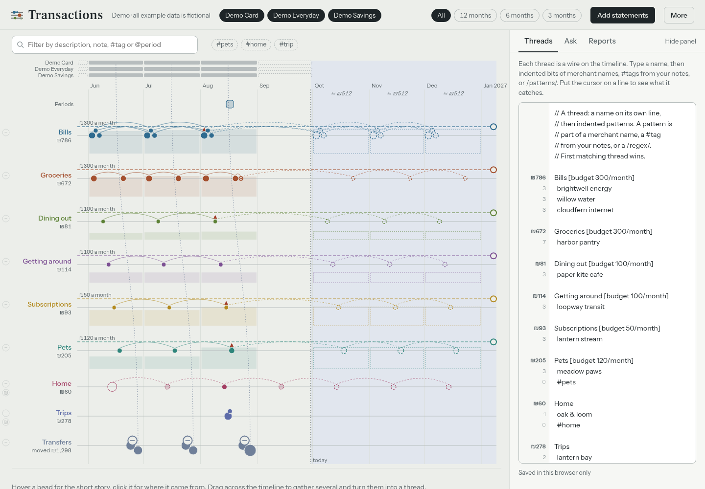

### 2. Import statements

Choose **Add statements** and select a CSV, spreadsheet, text, or HTML statement. Recognized formats load directly; other files open a mapping dialog. Choose the date, merchant, and amount columns, check the date format and amount sign, and review the preview before importing. Separate debit and credit columns are supported too.

This screenshot maps the five rows in the [sample CSV](docs/demo-statements.csv).

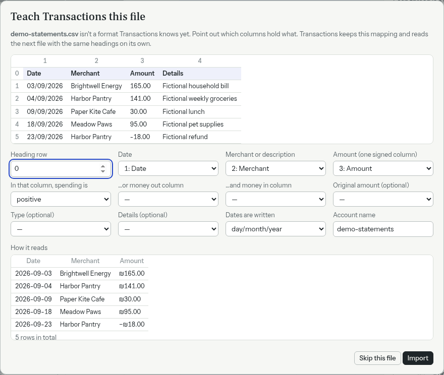

### 3. Accounts and date range

Click an account chip to include or exclude that account from the view. Use the range controls to focus on all data or the last three, six, or twelve months. These controls change the view while keeping the imported statements saved.

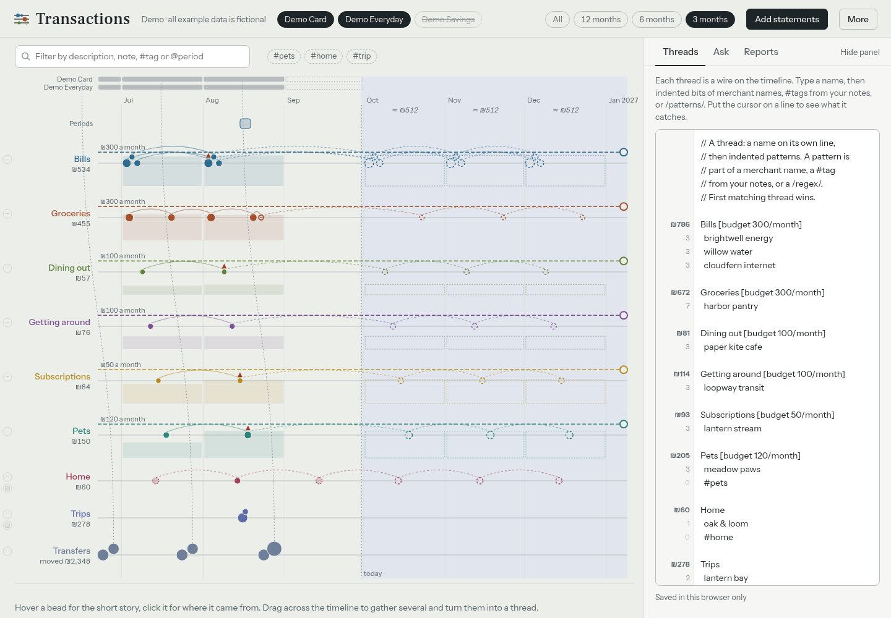

### 4. Threads and budgets

The **Threads** tab contains editable categorization rules. Write a thread name followed by indented merchant patterns or note tags. The first matching thread wins. A pattern such as `harbor pantry` matches that merchant; `#pets` matches a tag in transaction notes. Regular expressions use `/pattern/` syntax.

Add a monthly budget to the heading, for example `Groceries [budget 300/month]`. The timeline shows spending totals and budget progress. Edit the rules to match your own categories.

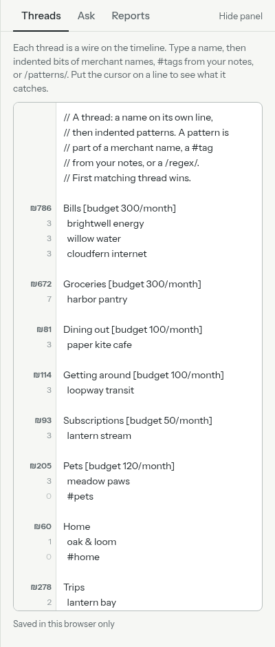

### 5. Search and tags

Use the filter above the timeline to search merchant names and notes. Search `#pets` to find tagged pet spending, use `@` to select a period, or prefix a term with `-` to exclude it. Multiple terms narrow the results together. Lenses also use the filtered transactions.

Here, `#pets` finds three charges totaling ₪205. Unrelated wires have been parked to make the matches easier to see.

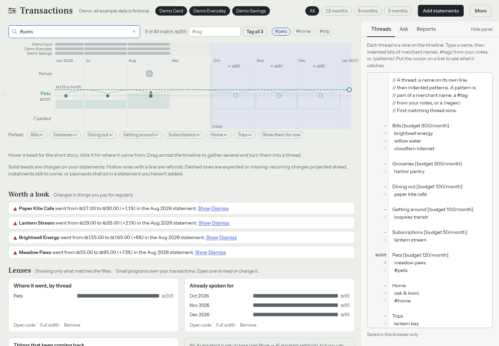

### 6. Transaction details and notes

Click a transaction to see its amount, date, account, and source statement. Edit its display name or add a note with searchable tags. The original merchant description remains available, so a friendlier name does not lose the statement's wording.

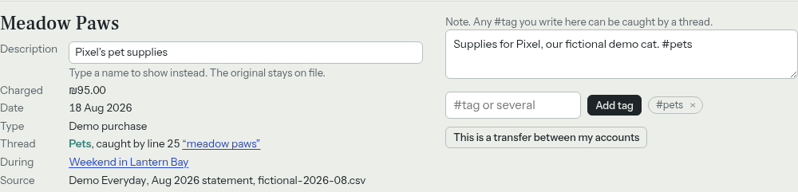

### 7. Bulk tags

Shift-click multiple dots, or drag a selection across the timeline, to work with several transactions together. The inspector shows the selection count and total. Add or remove a tag across the selection; an Undo action is available after changes.

These two Harbor Pantry charges have been tagged `#weekly-shop`.

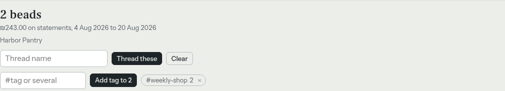

### 8. Transfers

Transfers between accounts and card payments should not count twice as spending. The app detects matching transfers and explains the other side in the inspector. You can also change a transaction's transfer status manually when a statement needs correction.

This fictional ₪350 transfer moves money to Demo Savings and is excluded from spending totals.

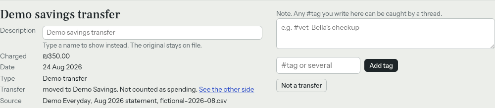

### 9. Spending changes

The changes panel highlights recurring merchant price changes and charges that appear to be missing from newer covered statement months. Choose **Show** to locate a change on the timeline or **Dismiss** to hide the alert.

The demo includes price increases for an energy bill, a subscription, café visits, and pet supplies.

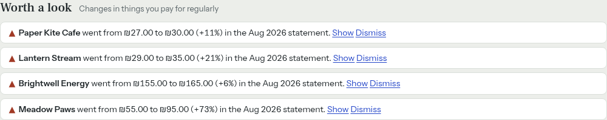

### 10. Periods

Drag across the period lane to mark a date range, then name it and add context. Click a period to inspect its spending breakdown, edit its dates, or filter to it. Move or resize the period on the timeline as your plans change.

The demo's **Weekend in Lantern Bay** includes all charges in those dates, including routine spending that happened during the trip. Its notes explain that distinction.

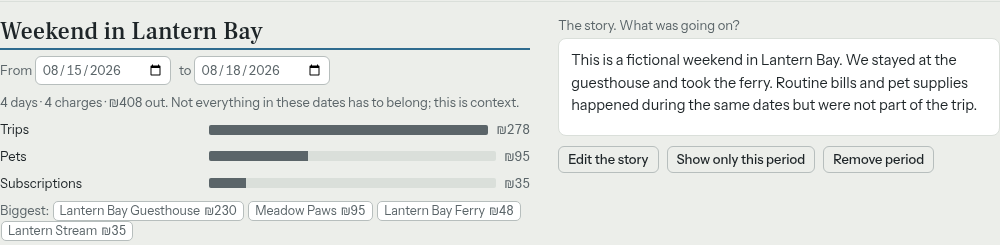

### 11. Lenses

Lenses are saved views calculated from the current transactions. The starter lenses summarize spending by thread, upcoming commitments, and recurring merchants. They can show bars, tables, numbers, or text. Click supported results to highlight their transactions on the timeline.

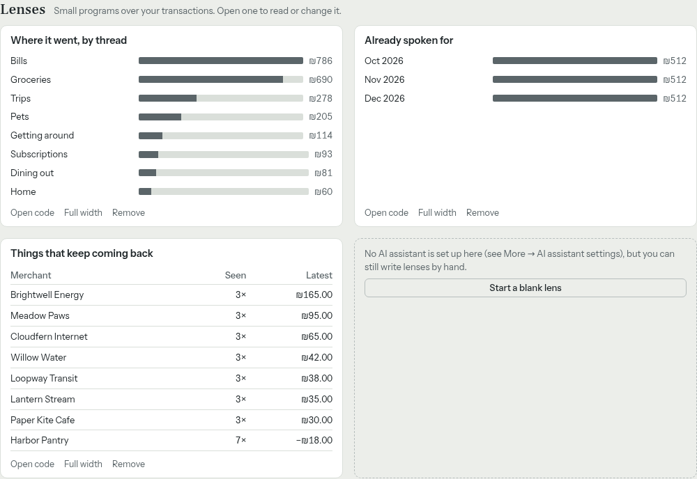

### 12. Edit lens code

Choose **Open code** on a lens to edit the JavaScript that calculates its result. You can also rename a lens, expand it, remove it, or add a blank one. If an assistant is connected, you can ask it to write a lens from a question.

The screenshot shows the code behind the spending-by-thread chart.

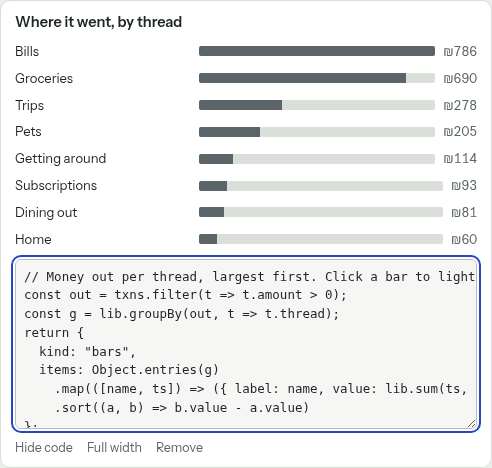

### 13. Park threads

Use a thread's park control to fold its wire out of the timeline. Parking keeps its rules and transactions while making a crowded view easier to read. Use the parked-thread chips to bring wires back. You can also hide the side pane to give the timeline more space.

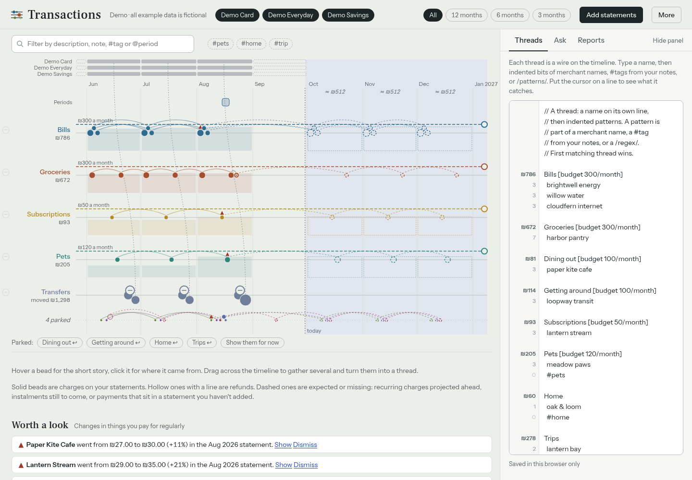

### 14. Export data

Under **More**, choose **Download threads (text)** for the categorization rules or **Download everything (JSON)** for a workspace backup. The JSON includes statements, rules, notes, display names, periods, reports, lenses, and saved workspace settings. AI credentials are excluded.

Browser downloads work when the standalone HTML is opened directly or served statically. Keep a backup before replacing a workspace or moving browsers.

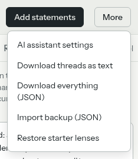

### 15. Import a backup or migrate from Abacus

In [abacus.html](abacus.html), choose **More → Download everything (JSON)**. In Transactions, choose **More → Import backup (JSON)** and select that file. Review the transaction, statement, period, and lens counts, then choose **Replace and import**.

The importer accepts both original Abacus exports and current Transactions backups. It validates the file before changing data, verifies the saved documents, and attempts to restore the previous workspace if saving fails. AI settings and keys stay in the browser. Bank statement files and thread-only exports use their own import flows.

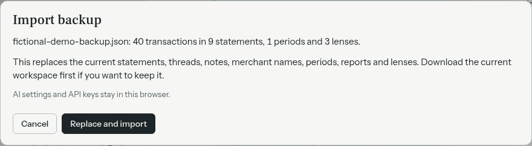

### 16. Connect an optional assistant

Open the AI settings to configure an OpenAI-compatible endpoint, model, and API key if the service requires one. Test the connection before saving. Inside Claude, the application can use the runtime's assistant capability.

This screenshot shows an example local endpoint with a placeholder model name and a blank key. No live assistant was connected for this guide. A standalone endpoint must accept requests from your browser.

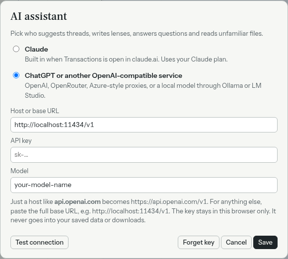

### 17. Ask about your transactions

The **Ask** tab offers starter questions and a conversation composer. With a configured assistant, ask about spending, recurring charges, or selected transactions. The assistant can suggest categorization rules, notes, periods, and lenses.

The screenshot shows the disconnected state; it contains no generated answers.

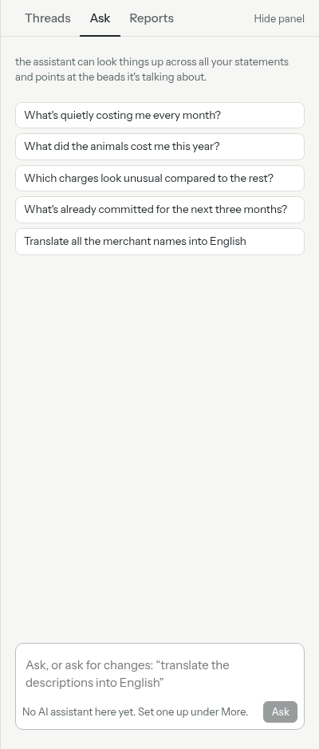

### 18. Save report questions

The **Reports** tab stores questions you want to revisit, such as “Which subscriptions increased in price?” Save a question, then run it with a connected assistant. Reports can be run again when you import new statements.

This demo report is saved but has not been run, so no AI result is shown.

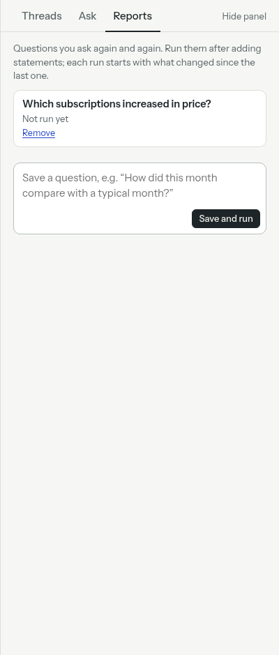

### 19. Inspect instalment forecasts

Click a future instalment mark to inspect the expected amount, date, and payment number. The inspector identifies the statement that supplied the plan. Recurring and instalment forecasts are estimates derived from imported data; they are separate from recorded charges.

The fictional Oak & Loom purchase has six ₪60 payments. This view shows the expected fourth payment on 14 October 2026.

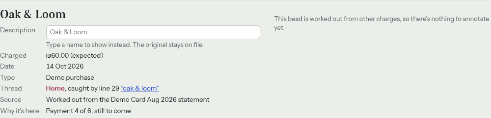

## Develop and build

Use Node.js 22 or newer.

```sh
npm ci
npm run check
```

`npm run build` bundles the JavaScript and inlines it with the CSS into a single HTML file. It writes identical copies to `dist/transactions.html` and `transactions.html`. `abacus.html` is the restored original application with browser export support; the build does not overwrite it. The root copy is ready for serving or publishing. Both are generated files; edit the source modules instead.

Serve the generated file from any static HTTP server, or open it directly in a browser. Node.js is only needed to build and test, not to serve the app.

For a local preview:

```sh
npm run build
python3 -m http.server 8000
```

Open `http://localhost:8000/transactions.html`. Rebuild after source changes. `index.html` is the build template, not the runnable app.

`npm test` runs the regression tests. `npm run format` formats the JavaScript and this README. `npm run check` checks formatting, runs the tests, and builds both HTML copies.

## Source structure

- `index.html` contains the page structure and the two build insertion markers.
- `styles.css` contains the styles.
- `main.js` creates application state, composes the modules, loads saved documents, and coordinates refreshes.
- `state.js` creates each application's mutable source state, capability references, and current derived view.
- `defaults.js` contains starter rules and lenses.
- `transactions/` contains statement parsing, mapping, rule interpretation, transfer detection, change detection, and transaction derivation.
- `storage.js` implements browser and Claude document storage behind `all`, `put`, and `del` methods. Browser storage and error reporting are injected.
- `persistence.js` owns the active storage adapter, debounced saves, and saved document shapes.
- `downloads.js` saves standalone exports through browser Blob downloads. Inside Claude, exports use its downloads capability.
- `assistant.js` implements the OpenAI-compatible provider. `ui/assistant-settings.js` selects the active provider and handles its settings.
- `suggestions.js` builds prompts for thread and lens suggestions.
- `ui/` groups rendering and event handling by feature.
- `scripts/build.mjs` generates the single-file output.
- `tests/` covers import and calculation semantics, storage behavior, and assistant requests.

`demo.js` generates three completed months of fictional statements, including recurring bills, a subscription price change, a refund, account transfers, an instalment plan, tagged notes, and a fictional trip. A new demo workspace loads these automatically; edits persist and deleted statements stay deleted.

The provided `.d.ts` files describe Claude runtime capabilities and are retained unchanged.

## Module conventions

Transaction calculations accept their inputs and return results. `deriveTransactions(state, { today })` calculates the current view without changing source data, reading the DOM, or writing storage. Passing `today` makes forecasts deterministic in tests. Its default is the browser session's date.

UI factories receive the application runtime and shared callbacks from `main.js`. The runtime's `derived` property always holds the latest calculation result. Each factory returns only the functions used by other modules; its other functions and interaction state remain private.

Use callbacks on `actions` for cross-feature operations rather than importing one UI module into another. Construct every module before wiring DOM events or calling startup, because those callbacks are populated during composition. `main.js` owns full and debounced refreshes.

Keep new transaction rules in `transactions/` and test them with plain data. Put a feature's DOM rendering and event handlers together in its UI module. Preserve the existing document keys and import IDs when changing persistence or parsing.

## Runtime dependencies

The generated file embeds this application's CSS and JavaScript. Fonts still come from Google Fonts, and XLSX support still comes from the existing CDN script. CSV import does not require XLSX. This output is suitable for static hosting, but it is not a fully offline package.

Inside Claude, startup can use the available `db`, `user`, `sample`, and `downloads` capabilities. Outside that runtime, saved documents use browser storage. An OpenAI-compatible assistant needs network access and an endpoint that accepts browser requests. Its settings and key stay in browser storage and are excluded from transaction exports.

Demo documents use the `transactions-demo:` browser prefix and the private Claude collection `data/users/<id>/transactions-demo/documents`. AI settings use `transactions-demo-ai-settings`. The demo does not read or modify the older personal storage keys or collection. Import mapping and saved batch shapes remain unchanged. Live Claude account access and real AI credentials are not required by the automated tests.

`files.zip` contains the rebuilt demo HTML and the provided capability declarations, without the old HTML version.

## GitHub Pages

The public demo is hosted at <https://adieyal.github.io/transactions/>. Pushing to `main` runs the checks, builds the single HTML file, and deploys it through the GitHub Pages workflow. The deployed root `index.html` is a copy of the built application; the repository's `index.html` remains the source template.

## License

Copyright 2026 Adi Eyal. Licensed under the [Apache License, Version 2.0](LICENSE).
