# Transactions

[Open the live demo](https://adieyal.github.io/transactions/) · [Apache 2.0 license](LICENSE)

Transactions turns your bank and card statements into a plain account of your months. Open it and it tells you, in a few sentences, what went out in a month, what was regular, how it compares with a typical month, and where your budgets stand. Every figure is tied to the transactions behind it: hover a sentence and those transactions light up on the timeline beside it.

A statement can show that in one month you paid a vet, a hardware shop and an airline. It can't show that the dog was ill, you were redoing the bathroom and you flew to a wedding. So the app notices things worth a word, such as a week of unusual purchases, a payment that stopped or a price that went up, and offers a short, optional question. Your answer becomes a period or a note, and the summary improves. Skip is always there, and a skipped question doesn't come back.

Everything works without an assistant: the questions come from rules and the summaries from templates. You can still connect one if you like, and it only receives data when you ask it something.

Your data stays where the app says it does. Opened on its own, Transactions keeps everything in this browser. Inside claude.ai, it saves privately to your Claude account. A chip in the header always says which.

For people who like to dig in, the rest is still there: threads you define in a short text list, budgets, notes and #tags, transfers matched between your own accounts, forecasts of recurring charges and instalments, and lenses, small JavaScript views you can read and edit.

Transactions is a single HTML file. Open it in a browser or serve it from any static host.

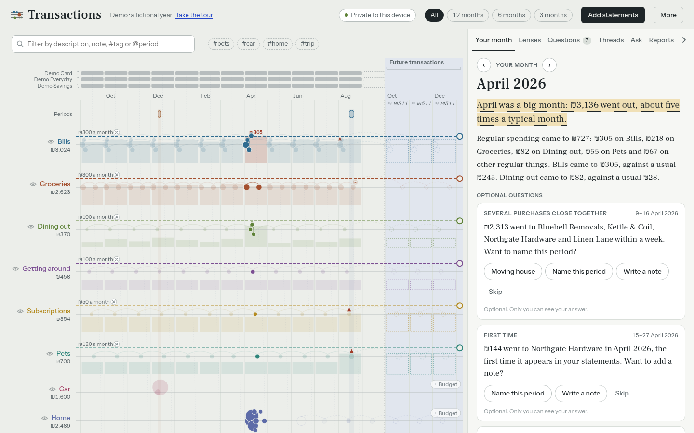

## Try the demo

Open [transactions.html](transactions.html). A new workspace starts with a fictional year across Demo Card, Demo Everyday and Demo Savings. The car breaks down and the holiday savings pause for two months, a move to a new flat brings a burst of appliances, and the year ends with the holiday the savings were for. The car and the holiday come with their periods and notes. The move is left for you: the app asks about it, and the tour shows you how to answer. Changes are saved in your browser.

The screenshots below use fictional merchants, accounts and notes, and were captured at 1440×900 with the date fixed to 30 September 2026, so the statements cover September 2025 to August 2026 and the move falls in April. A fresh demo's dates follow the current month.

You can download the [sample statement CSV](docs/demo-statements.csv) to try column mapping, or the [demo workspace backup](docs/demo-backup.json) to reproduce the illustrated dataset. Importing a backup replaces your current workspace after confirmation; export it first if you want to keep it.

## Feature guide

### 1. Your month

The side panel opens on **Your month**, a summary of the latest month with statements. Use ‹ and › to move between months. Each summary says what went out and how that compares with a typical month (the median of your other months, leaving out spending inside periods), what your regular spending came to, what happened in any period that overlaps the month, how much you moved between your own accounts, and where each budget stands, such as "Bills ₪305 of ₪300". Questions about the month appear inline.

Underlined phrases are tied to their transactions. Hover or tab to one and its beads light up on the timeline. Text you wrote yourself, such as a period's description, is shown apart and labelled as yours.

Here, hovering "April was a big month: ₪3,136 went out, about five times a typical month" lights up April's 20 charges.


### 2. Questions

The app looks for a few kinds of things worth a word: several purchases close together, a charge larger than usual, a regular payment that's missing or stopped, a price change, a new merchant, a purchase on the same day every month, and a budget gone over. Each becomes a short question that states the fact and offers an answer. Things you've already explained with a period or a note are left out, and there are never more than three open questions for a month.

The **Questions** tab lists them all, with a reminder that answers are optional and only you can see them. Click a question to light up its transactions. Suggested answers come from the merchant's name (in English or Hebrew) or from your last answer for the same merchant, alongside **Name this period**, **Write a note** and **Skip**.

The demo opens with seven questions. The highlighted one is the week of the move.

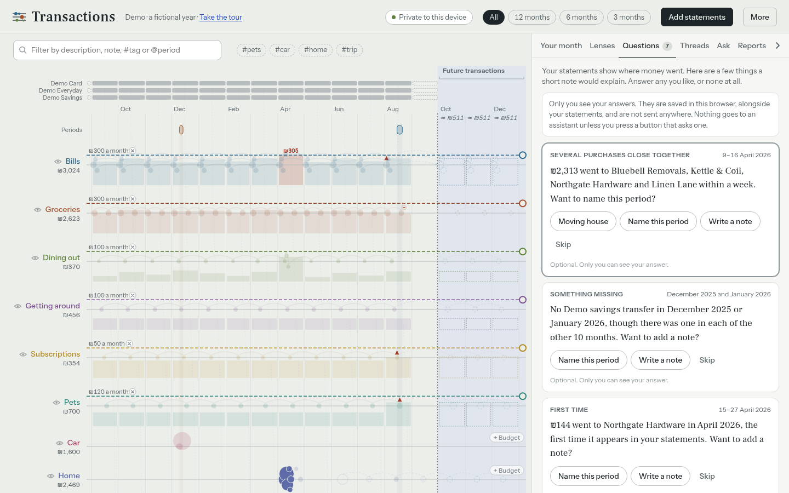

### 3. Answer a question

Naming a period adds it to the timeline over the question's dates. Writing a note adds it to the transactions involved. Either way the question closes, the summary updates, and the message at the bottom offers Undo.

Answering the move question with "Moving house" adds a period for 9–16 April 2026, and April's summary now tells it: "“Moving house”, 9–16 April 2026: ₪2,313 went out, with ₪1,505 at Kettle & Coil (three purchases), ₪640 at Bluebell Removals, ₪120 at Linen Lane and ₪48 at Northgate Hardware."

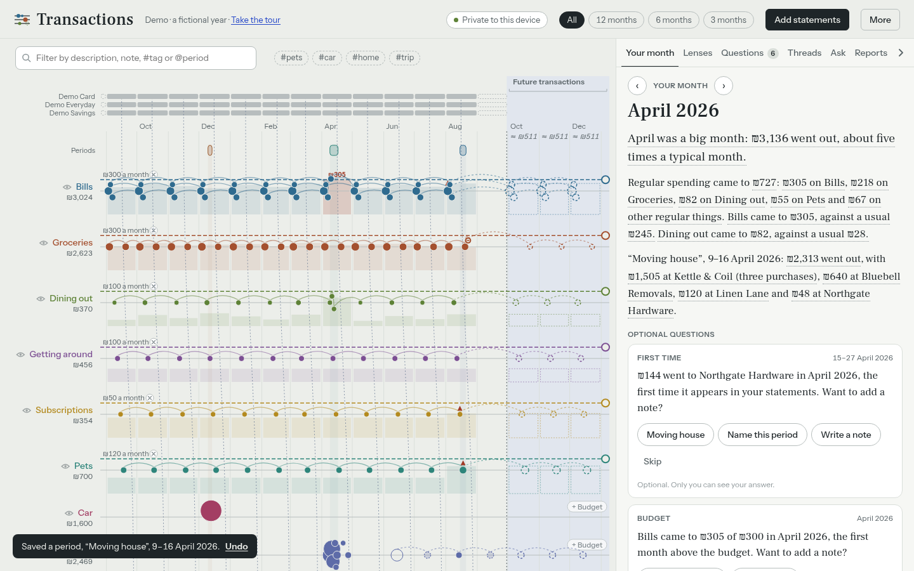

### 4. Periods

Periods mark the stretches of time that mattered: a trip, a move, a renovation. Answer a question, drag across the period lane, or select transactions and choose **Mark as a period**. Click a period to open it below the timeline.

The inspector keeps **Your description**, in your own words, apart from a generated **Summary**. The summary counts what went out in the period's dates but leaves regular spending, such as bills and groceries that happened anyway, to one line. Tick **Also list regular spending in these dates** to see it broken down. **Your notes** lists the notes on the period's transactions. You can still edit the name and dates, filter to the period, or remove it.

The demo's **Holiday in Lantern Bay**: ₪770 went out at the guesthouse, the ferry and a fish bar, and three regular charges (₪214) also fell in those dates.

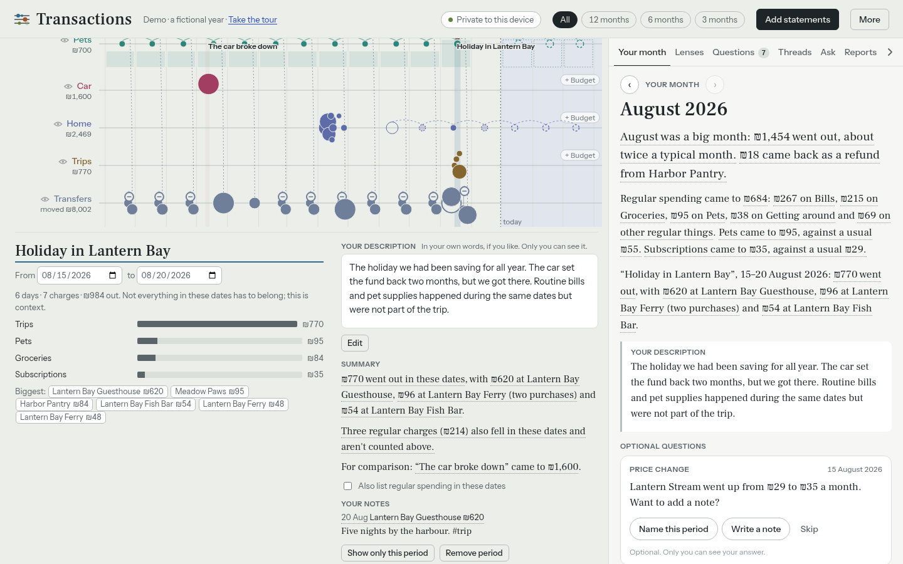

### 5. Thread summaries

Click a thread's name on the timeline. Its beads light up and its summary opens below: how many charges, the total and a typical amount, any same-day habit, the busiest month, and how it went against its budget. A month strip shows the shape of the year, and **Blow by blow** lists every transaction with the period it fell in and its note. **Edit rules** takes you to the thread's line in the Threads editor.

For Dining out: 14 charges, ₪370 in all, 12 of them at Paper Kite Cafe on the 9th of the month, and within the ₪100 budget every month.

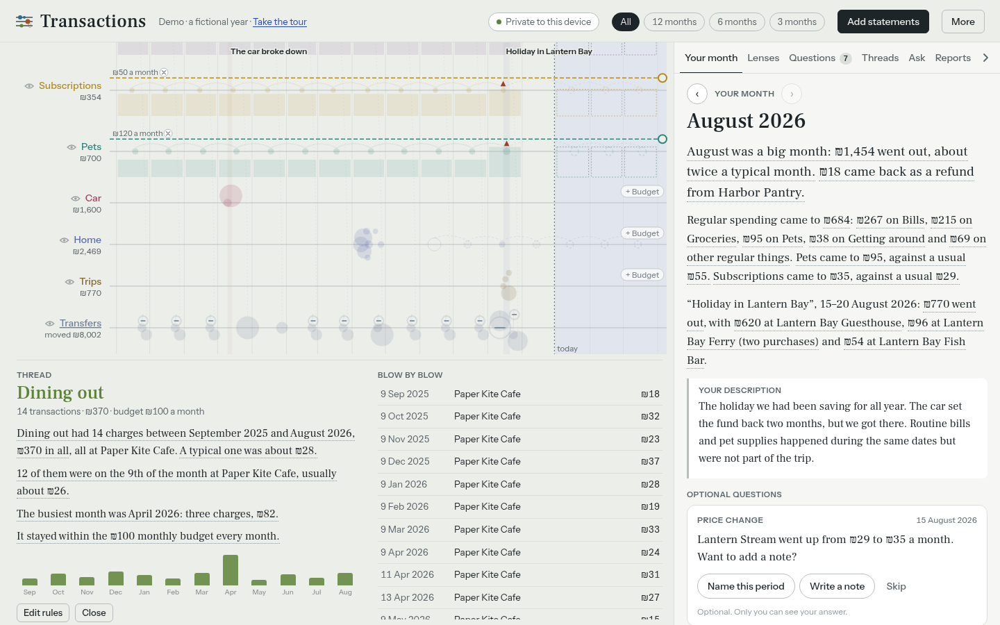

### 6. Privacy

The chip in the header says where your data is kept: **Private to this device** when Transactions runs on its own, or **Saved privately to your Claude account** inside claude.ai. Click it for the details. Nothing is sent to an assistant unless you press a button that asks one.

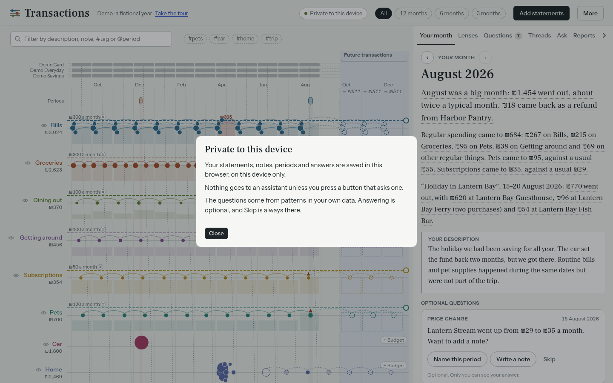

### 7. Spending timeline

Each horizontal wire is a spending thread. Solid dots are imported charges; outlined dots mark refunds. Dashed marks show expected charges, and the shaded area marks future dates. Hover over a dot for a summary or click it to inspect the transaction. The coverage bars at the top show which account statement months have been imported.

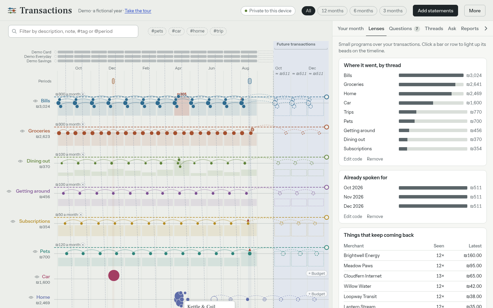

### 8. Import statements

Choose **Add statements** and select a CSV, spreadsheet, text, or HTML statement. Recognized formats load directly; other files open a mapping dialog. Choose the date, merchant, and amount columns, check the date format and amount sign, and review the preview before importing. Separate debit and credit columns are supported too.

This screenshot maps the five rows in the [sample CSV](docs/demo-statements.csv).

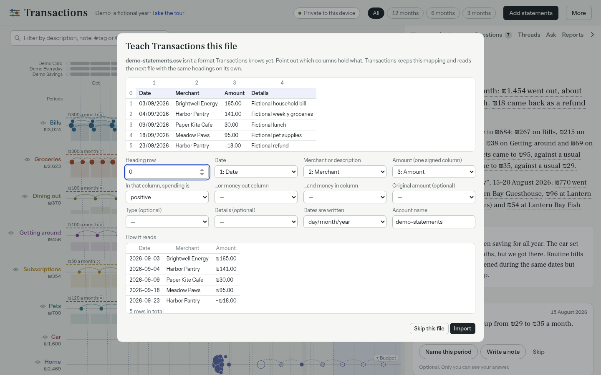

### 9. Accounts and date range

Click an account's name beside its statement bars, at the top of the timeline, to include or exclude that account from the view. Hidden accounts stay listed, dimmed, so you can turn them back on. Use the range controls to focus on all data or the last three, six, or twelve months. These controls change the view while keeping the imported statements saved.

Here Demo Savings is hidden and the timeline shows the last three months.

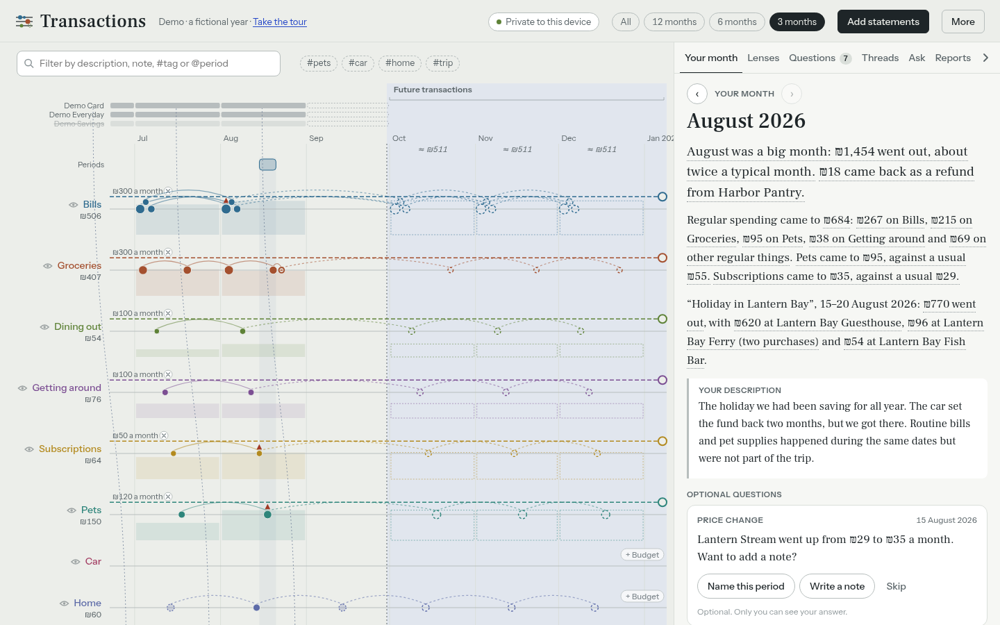

### 10. Threads and budgets

The **Threads** tab contains editable categorization rules. Write a thread name followed by indented merchant patterns or note tags. The first matching thread wins. A pattern such as `harbor pantry` matches that merchant; `#pets` matches a tag in transaction notes. Regular expressions use `/pattern/` syntax. Put the cursor on a line to see which charges it catches.

Add a monthly budget to the heading, for example `Groceries [budget 300/month]`. The timeline shows spending totals and budget progress, and Your month states each budget as an amount of its limit. Edit the rules to match your own categories.

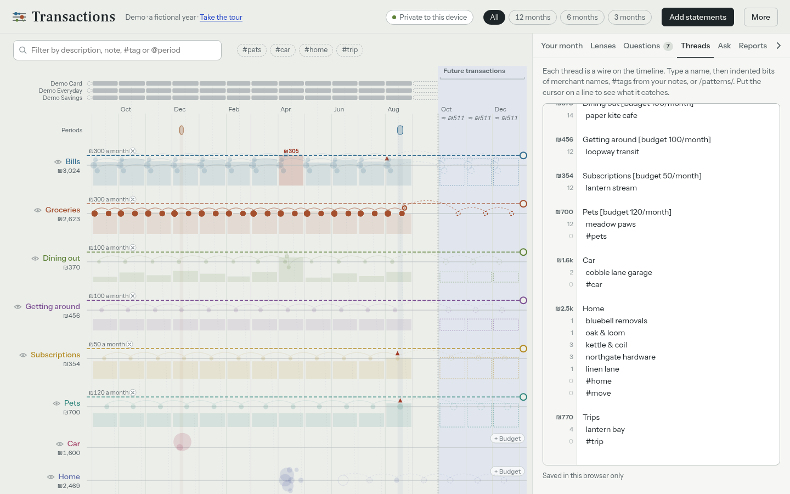

### 11. Search and tags

Use the filter above the timeline to search merchant names and notes. Search `#pets` to find tagged pet spending, use `@` to select a period, or prefix a term with `-` to exclude it. Multiple terms narrow the results together. Lenses also use the filtered transactions.

Here, `#pets` finds 12 of the demo's 161 charges, ₪700 in all.

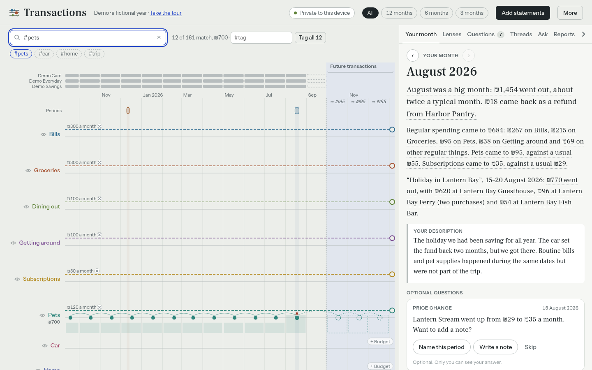

### 12. Transaction details and notes

Click a transaction to see its amount, date, account, and source statement. Edit its display name or add a note with searchable tags. The original merchant description remains available, so a friendlier name does not lose the statement's wording.

This is August's ₪95 Meadow Paws charge with its pet-supplies note.

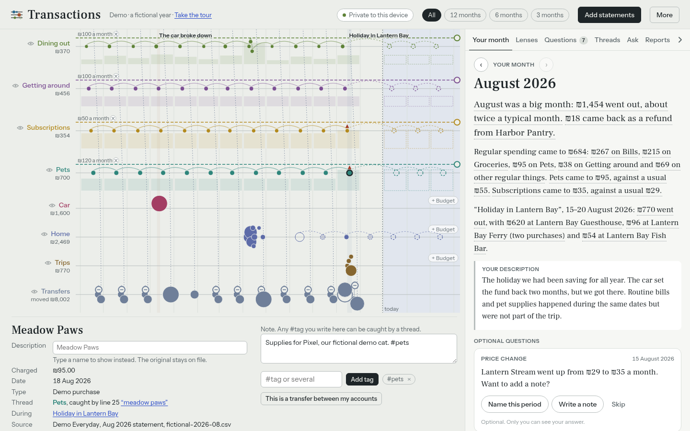

### 13. Bulk tags

Shift-click multiple dots, or drag a selection across the timeline, to work with several transactions together. The inspector shows the selection count and total. Add or remove a tag across the selection; an Undo action is available after changes.

These two July Harbor Pantry charges, ₪210 together, have been tagged `#weekly-shop`.

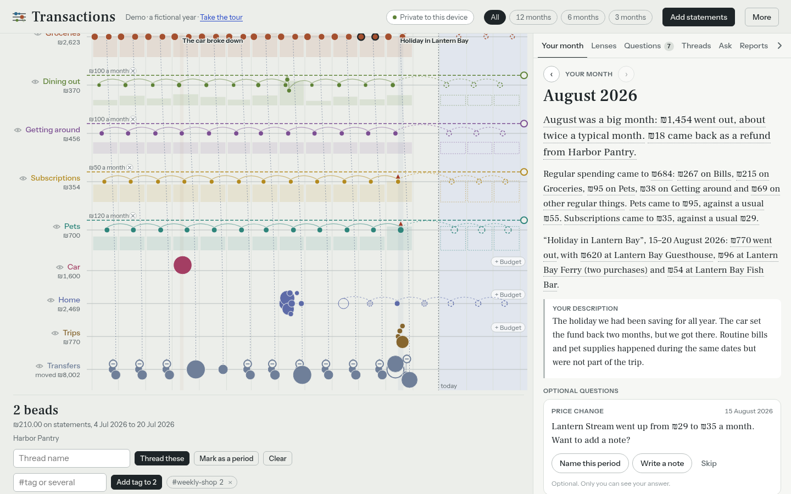

### 14. Transfers

Transfers between accounts and card payments should not count twice as spending. The app detects matching transfers and explains the other side in the inspector. You can also change a transaction's transfer status manually when a statement needs correction.

This fictional ₪150 transfer on 24 July 2026 moves money to Demo Savings and is excluded from spending totals.

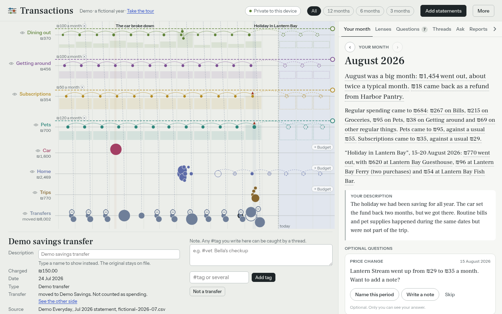

### 15. Lenses

Lenses are saved views calculated from the current transactions. They open in the **Lenses** tab of the side panel, so they stay beside the timeline as you scroll. The starter lenses summarize spending by thread, upcoming commitments, and recurring merchants. They can show bars, tables, numbers, or text. Click supported results to highlight their transactions on the timeline.

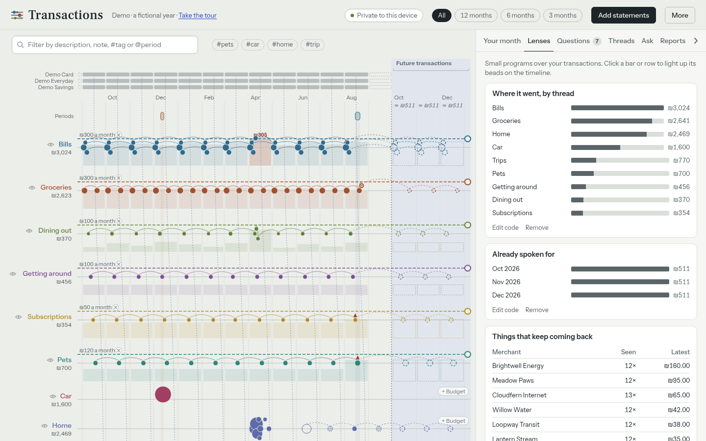

### 16. Edit lens code

Choose **Edit code** on a lens to open the editor. It highlights the JavaScript that calculates the result, suggests `txns`, `lib` and transaction fields as you type, marks syntax errors, and shows a live preview beside a reference of everything a lens can use. Press Escape or **Done** to close it. You can also rename a lens, remove it, or add a blank one. If an assistant is connected, you can ask it to write a lens from a question.

The screenshot shows the code behind the spending-by-thread chart.

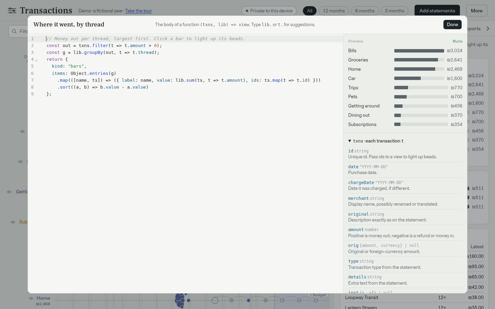

### 17. Park threads

Use a thread's park control to fold its wire out of the timeline. Parking keeps its rules and transactions while making a crowded view easier to read. Use the parked-thread chips to bring wires back. You can also hide the side panel to give the timeline more space.

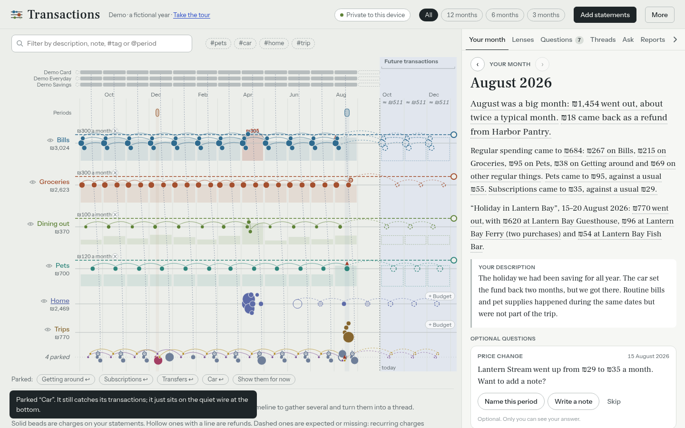

### 18. Export data

Under **More**, choose **Download threads as text** for the categorization rules or **Download everything (JSON)** for a workspace backup. The JSON includes statements, rules, notes, display names, periods, answers to questions, reports, lenses, and saved workspace settings. AI credentials are excluded.

Browser downloads work when the standalone HTML is opened directly or served statically. Keep a backup before replacing a workspace or moving browsers.

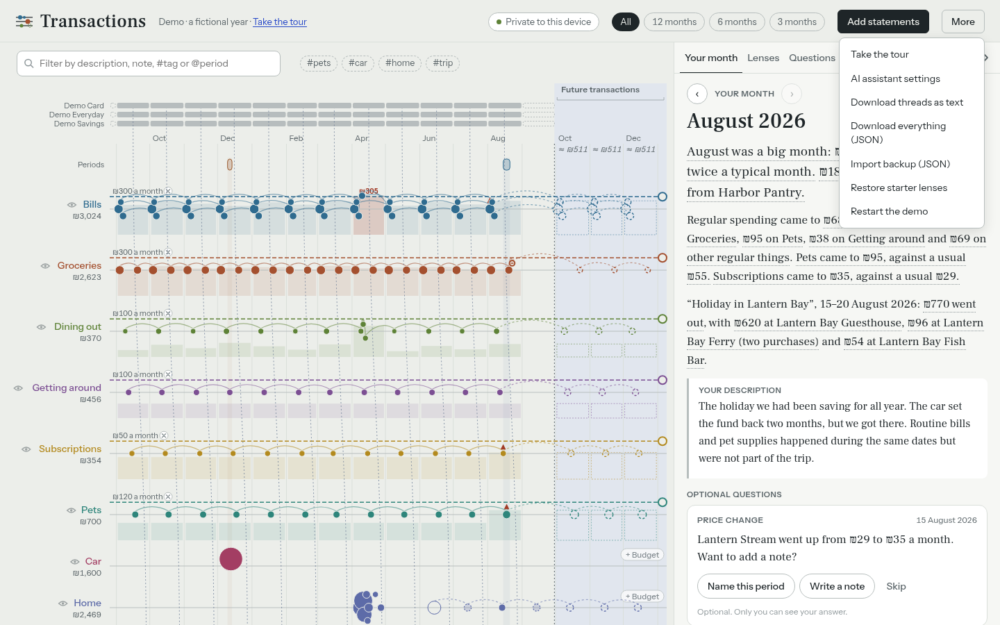

### 19. Import a backup or migrate from Abacus

In [abacus.html](abacus.html), choose **More → Download everything (JSON)**. In Transactions, choose **More → Import backup (JSON)** and select that file. Review the transaction, statement, period, and lens counts, then choose **Replace and import**.

The importer accepts both original Abacus exports and current Transactions backups. It validates the file before changing data, verifies the saved documents, and attempts to restore the previous workspace if saving fails. AI settings and keys stay in the browser. Bank statement files and thread-only exports use their own import flows.

The [demo backup](docs/demo-backup.json) holds 161 transactions in 36 statements, two periods and three lenses.

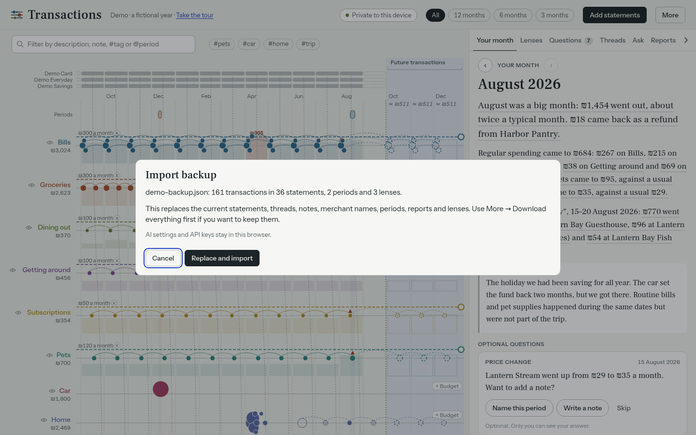

### 20. Connect an optional assistant

Everything above works without one. If you'd like help with phrasing and suggestions, open the AI settings to configure an OpenAI-compatible endpoint, model, and API key if the service requires one. Test the connection before saving. Inside Claude, the application can use the runtime's assistant capability. An assistant only receives data when you ask it something.

This screenshot shows an example local endpoint with a placeholder model name and a blank key. No live assistant was connected for this guide. A standalone endpoint must accept requests from your browser.

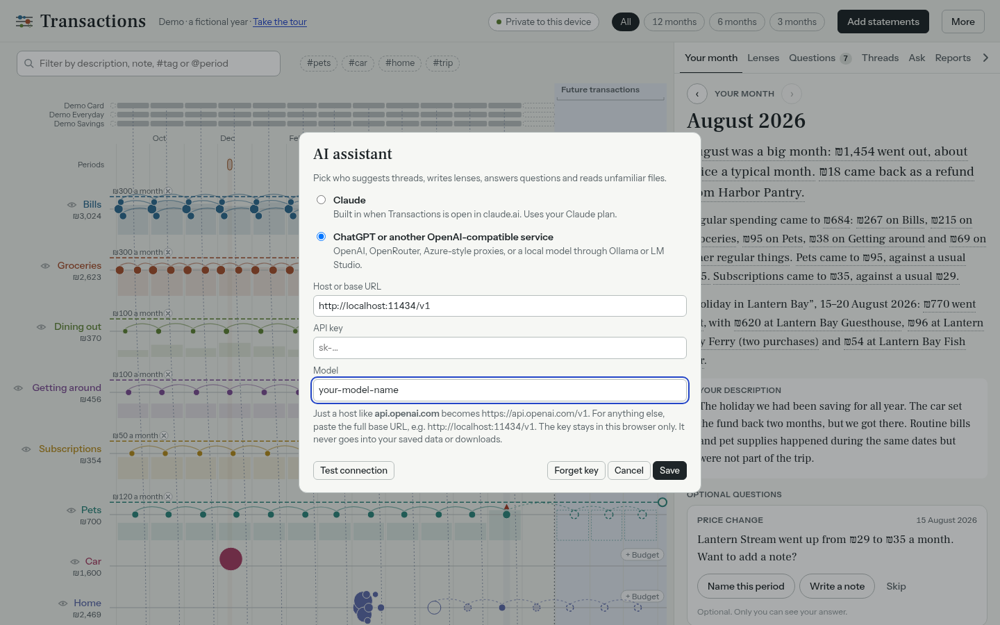

### 21. Ask about your transactions

The **Ask** tab offers starter questions and a conversation composer. With a configured assistant, ask about spending, recurring charges, or selected transactions. The assistant can suggest categorization rules, notes, periods, and lenses.

The screenshot shows the disconnected state; it contains no generated answers.

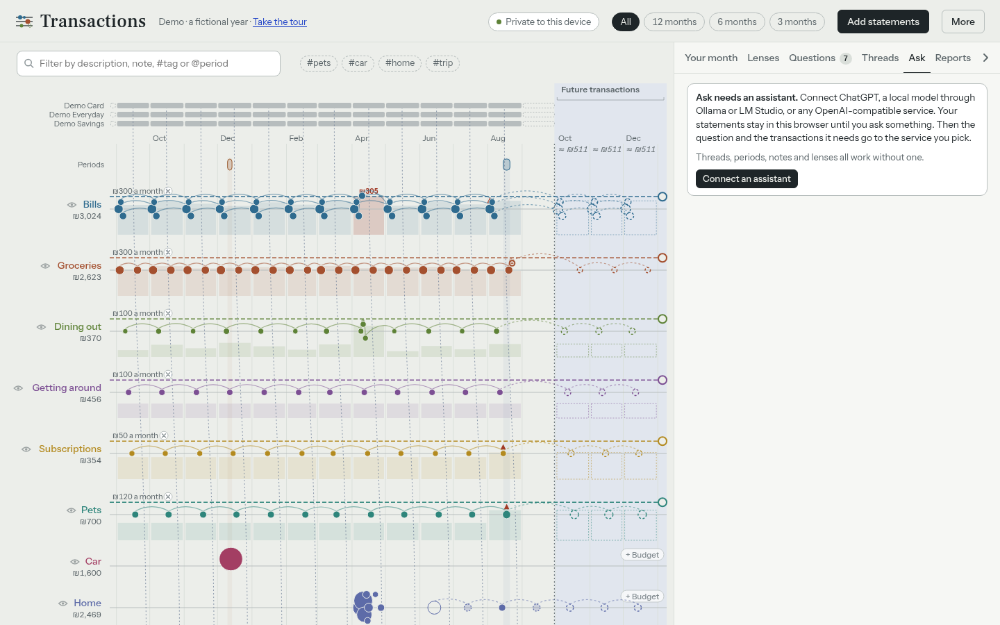

### 22. Save report questions

The **Reports** tab stores questions you want to revisit, such as “Which subscriptions increased in price?” Save a question, then run it with a connected assistant. Reports can be run again when you import new statements.

This demo report is saved but has not been run, so no AI result is shown.

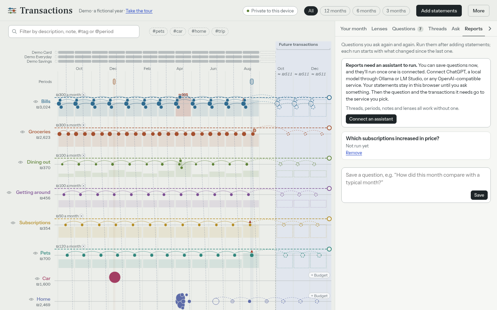

### 23. Inspect instalment forecasts

Click a future instalment mark to inspect the expected amount, date, and payment number. The inspector identifies the statement that supplied the plan. Recurring and instalment forecasts are estimates derived from imported data; they are separate from recorded charges.

The fictional Oak & Loom purchase has six ₪60 payments. This view shows the expected fourth payment on 14 October 2026.

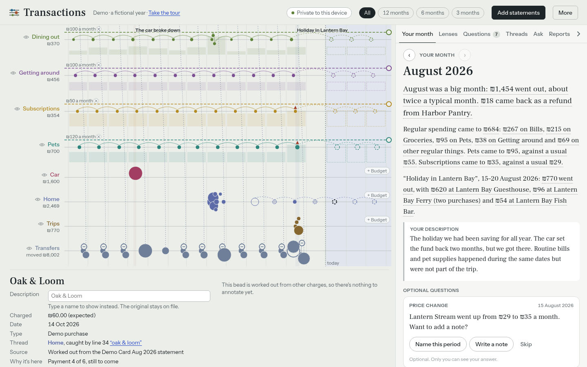

## Develop and build

Use Node.js 22 or newer.

```sh
npm ci
npm run check
```

`npm run build` bundles and minifies the JavaScript and inlines it with the CSS into a single HTML file. It writes identical copies to `dist/transactions.html` and `transactions.html`. `abacus.html` is the restored original application with browser export support; the build does not overwrite it. The root copy is ready for serving or publishing. Both are generated files; edit the source modules instead.

Serve the generated file from any static HTTP server, or open it directly in a browser. Node.js is only needed to build and test, not to serve the app.

For a local preview:

```sh
npm run build
python3 -m http.server 8000
```

Open `http://localhost:8000/transactions.html`. Rebuild after source changes. `index.html` is the build template, not the runnable app.

`npm test` runs the regression tests. `npm run format` formats the JavaScript and this README. `npm run check` checks formatting, runs the tests, and builds both HTML copies.

## Source structure

- `index.html` contains the page structure and the two build insertion markers.
- `styles.css` contains the styles.
- `main.js` creates application state, composes the modules, loads saved documents, and coordinates refreshes.
- `state.js` creates each application's mutable source state, capability references, and current derived view.
- `defaults.js` contains starter rules and lenses.
- `transactions/` contains statement parsing, mapping, rule interpretation, transfer detection, change detection, and transaction derivation.
- `story/` turns derived transactions into words without an assistant: `moments.js` finds things worth a question and gives each a stable id, `summary.js` builds the month, period and thread summaries as sentences tied to transaction ids, `answers.js` works out what an answer changes, and `copy.js` holds the phrasing, number and date helpers.
- `storage.js` implements browser and Claude document storage behind `all`, `put`, and `del` methods. Browser storage and error reporting are injected.
- `persistence.js` owns the active storage adapter, debounced saves, and saved document shapes.
- `downloads.js` saves standalone exports through browser Blob downloads. Inside Claude, exports use its downloads capability.
- `assistant.js` implements the OpenAI-compatible provider. `ui/assistant-settings.js` selects the active provider and handles its settings.
- `suggestions.js` builds prompts for thread and lens suggestions.
- `ui/` groups rendering and event handling by feature, including `month.js` (Your month), `questions.js` (question cards and the privacy chip), `thread-summary.js` and `highlight.js` (hovering a phrase to light up its beads).
- `scripts/build.mjs` generates the single-file output.
- `tests/` covers import and calculation semantics, moments, answers and summaries against the demo year, storage behavior, and assistant requests.

`demo.js` generates twelve completed months of fictional statements, including recurring bills, a subscription price change, a refund, account transfers, an instalment plan, tagged notes, and two periods: a car repair and a holiday. The house move is left unexplained so the demo can ask about it. A new demo workspace loads these automatically; edits persist and deleted statements stay deleted.

The provided `.d.ts` files describe Claude runtime capabilities and are retained unchanged.

## Module conventions

Transaction calculations accept their inputs and return results. `deriveTransactions(state, { today })` calculates the current view without changing source data, reading the DOM, or writing storage. Passing `today` makes forecasts deterministic in tests. Its default is the browser session's date.

UI factories receive the application runtime and shared callbacks from `main.js`. The runtime's `derived` property always holds the latest calculation result. Each factory returns only the functions used by other modules; its other functions and interaction state remain private.

Use callbacks on `actions` for cross-feature operations rather than importing one UI module into another. Construct every module before wiring DOM events or calling startup, because those callbacks are populated during composition. `main.js` owns full and debounced refreshes.

Keep new transaction rules in `transactions/` and test them with plain data. Put a feature's DOM rendering and event handlers together in its UI module. Preserve the existing document keys and import IDs when changing persistence or parsing.

## Runtime dependencies

The generated file embeds this application's CSS and JavaScript. Fonts still come from Google Fonts, and XLSX support still comes from the existing CDN script. CSV import does not require XLSX. This output is suitable for static hosting, but it is not a fully offline package.

Inside Claude, startup can use the available `db`, `user`, `sample`, and `downloads` capabilities. Outside that runtime, saved documents use browser storage. An OpenAI-compatible assistant needs network access and an endpoint that accepts browser requests. Its settings and key stay in browser storage and are excluded from transaction exports.

Demo documents use the `transactions-demo:` browser prefix and the private Claude collection `data/users/<id>/transactions-demo/documents`. AI settings use `transactions-demo-ai-settings`. The demo does not read or modify the older personal storage keys or collection. Import mapping and saved batch shapes remain unchanged. Live Claude account access and real AI credentials are not required by the automated tests.

`files.zip` contains the rebuilt demo HTML and the provided capability declarations, without the old HTML version.

## GitHub Pages

The public demo is hosted at <https://adieyal.github.io/transactions/>. Pushing to `main` runs the checks, builds the single HTML file, and deploys it through the GitHub Pages workflow. The deployed root `index.html` is a copy of the built application; the repository's `index.html` remains the source template.

## License

Copyright 2026 Adi Eyal. Licensed under the [Apache License, Version 2.0](LICENSE).
