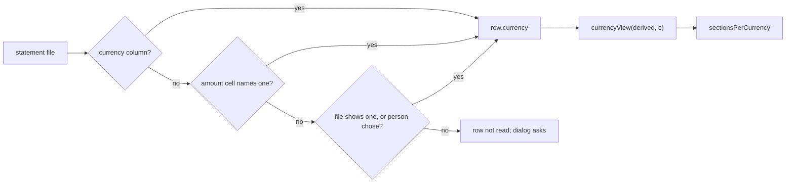

# 0008. Money carries its statement's currency

Status: accepted, 2026-10-04

## Context

Charter decision 12 (user, 2026-10-04): use the statement's currency, never a default. Before it, every amount was read and shown as shekels, and a generic import saved an original amount without a currency as ILS. Statements can be in any currency, and one workspace can hold several.

## Decision

- **Per-row currency.** Every saved statement (`batch.currency`) and every row (`row.currency`) records its ISO 4217 code. A batch whose rows are in several currencies has `currency: null`; its rows still name theirs.
- **Where it comes from, in order:** a currency column, the amount cell itself (`EUR 90.00`, `£3`), then the one the file shows or the person chose in the import dialog (`rowCurrency` in `transactions/import.js`). A recognised format names its own (`FORMAT_CURRENCY`). A heading counts only for a code in capitals standing on its own (`Amount (USD)`).
- **No default.** When nothing says the currency, the import dialog asks and Import stays disabled. Old statements take their format's currency on load (`withCurrencies` in `documents.js`); the rest wait, off the page, until the person answers (`needsCurrency`, `answerCurrencies`). An original amount that was only main's default ILS is dropped. The demo states its currency in its data.
- **No conversion.** Amounts in different currencies are never added, compared or paired. Story code meets money only through `story/currency.js`: `currencyView` (the derived data as if one currency existed) and `sectionsPerCurrency` (a story told once per currency, under its own heading). Formatting always names the currency (`fmt`, `fmtExact` in `helpers.js`).

## Consequences

- A new money sentence takes its currency from the view it is built from, never from a constant.
- Open, deferred by the user: which currency a bare budget amount is in, how `$` and `¥` are disambiguated, and moment ids that can collide across currencies.
