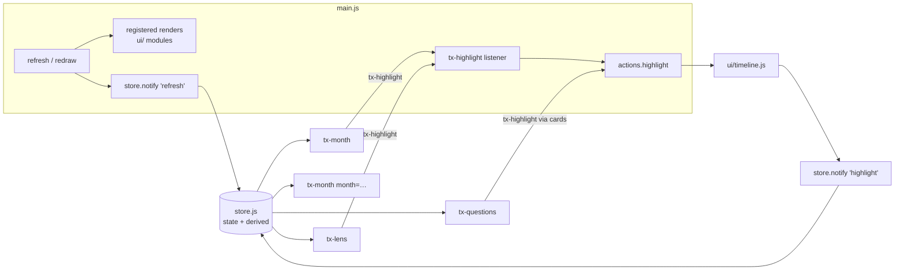

# 0009. Web components as the UI boundary

Status: accepted, 2026-10-04 (the user's decision; first slice on `webcomponents`)

## Context

The 26 `ui/` modules draw into fixed ids in `index.html`. On `currency` (a46fe9e) there were 102 distinct ids and 257 `$(` calls in `ui/` and `suggestions.js`. Each module exists once, and every refresh redraws all of them. That makes the layouts the user is trying out hard to build: a Story view, an Abacus view, phone layouts. A piece can't appear twice, because its render looks up its one id. A piece can't move either, because other modules look it up by id too (the tour finds `#month .msum`, and the lens list found `#lenses [data-lens=…]`).

## Decision

- **Plain custom elements.** `customElements.define`, with no framework and no new dependency. The bundle stays one file.
- **Light DOM.** There is no shadow root, so `styles.css`, the theme tokens and dark mode apply as they do today.
- **A small shared store.** `store.js` wraps the runtime's `state` and `derived` data, and holds nothing of its own. Components call `store.subscribe(fn)`, and `fn(change)` gets one of two changes:
  - `"refresh"`: `main.js` sends it after every `redraw()`, so the one refresh path of ADR 0004 still drives everything;
  - `"highlight"`: the timeline sends it when beads light up. Hover is too frequent for a full refresh, so components only re-mark what is lit.
- **Configured by attributes.** Examples are `<tx-month month="2026-08">`, `<tx-questions limit="2">`, `<tx-lens lens="l1" titled>`. A component with no attributes behaves as the old pane did. For example, `<tx-month>` follows the app's month (`state.monthView`).
- **Events out, not calls across.** A component asks for something with a bubbling `CustomEvent` and never calls another component:
  - `tx-highlight`, with `{ ids, clearSelection }`, which `main.js` answers with `actions.highlight`;
  - `tx-lens-ran`, with `{ lens, error }`, which the lens list uses for its Fix button.

  Later steps add `tx-select` and `tx-answer` the same way.

- **Draws only inside itself.** A component reads and writes only `this` and its descendants: `this.innerHTML`, `this.querySelector`. It never uses `$("#…")` or `document.querySelector`. The test "components draw only inside themselves" enforces this. Any number of copies can therefore sit on one page.
- **Layouts are markup.** A layout is an arrangement of elements in HTML. The `#lab` prototype in `index.html` puts two months side by side, with the top two questions and a lens beside them, all from one store.

### Coexisting with the registry and the existing modules

- **A component file still exports a `contract`.** Its `create(runtime, actions)` captures the scoped `actions` and returns one `defineX` function, listed in `wires`. That function runs at boot and defines the element. So the registry still checks every `actions.X` a component uses, and the factory still does nothing while it is being built (the Node test builds it).
- **`renders` is empty.** Components redraw from the store, not from the render list.
- **Old modules keep working unchanged.** They host components where they used to draw. The lens list writes `<tx-lens>` into each card, and `index.html` has `<tx-month id="month">`, so the tour's `#month .msum` still finds it.
- **Shared pieces stay in their module until their step.** A question card's markup and answers stay in `ui/questions.js` (`questionCard`, `wireCards`), which `<tx-month>` and `<tx-questions>` both use through `actions`. R13 makes a card its own `<tx-question>`.
- **The migration order** is R13, then R14, then R15 (`docs/refactor-backlog.md`). Each step deletes its entries from `REACH_ALLOW`.

## Consequences

- A piece can appear twice and move between layouts by editing markup. The `#lab` check in headless Chrome confirmed this: two months, a question list and a lens, all lighting up together.
- A component that isn't visible (`checkVisibility()`) skips drawing. Opening a tab redraws, as before.
- Rendering stays coarse: on `"refresh"`, every connected component redraws. ADR 0004's reasoning still applies, and a profile, not a guess, would justify anything narrower.
- Until R13 to R15 finish, there are two ways to draw. 21 modules are allowlisted under "reaches outside itself", and the guardrail stops new ones.
- Rejected:
  - **Shadow DOM:** it would cut components off from the shared stylesheet and theme tokens.
  - **Lit or another library:** a dependency and bundle growth for little gain at this size.
  - **Per-topic subscriptions:** see ADR 0004.
