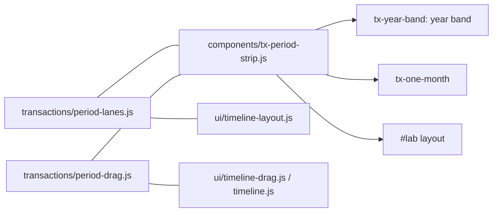

# 0011. One Periods strip for every view

Status: accepted, 2026-10-04 (the user's decision after testing canvas-ui)

## Context

The canvas views rewrote period editing: a strip per view in `tx-year-band.js` and `tx-one-month.js`, with their own drag code. The person found it worse than the old timeline's. Periods dragged onto each other overlapped instead of moving to another row, and could only be resized by small handles. They asked for the old behaviour, built so it "can be reused without drifting from its implementation".

## Decision

- **Pure rules, one module each, in the domain layer:**
  - `transactions/period-lanes.js` (`periodLanes`) packs periods into lanes, earliest first, as `ui/timeline-layout.js` always did;
  - `transactions/period-drag.js` (`periodAt`, `startDrag`, `dragTo`, `nudge`, `monthsScale`) holds the move and resize maths. It takes the view's geometry as x positions and `inv(x)`, the time at x.
- **One element, `<tx-period-strip>`** (`components/tx-period-strip.js`), owns the canvas strip and every period interaction:
  - drawing a new period (`tx-mark-period`);
  - moving and resizing (grab the name or the column, or a side within 4px along the full height);
  - stacking names that would overlap;
  - the card to rename, open details (`tx-open-period`) or delete through `removePeriod` with Undo;
  - the arrow keys and touch.
- **The element's contract:**
  - Attributes: `months="YYYY-MM,…"` (equal columns), `variant="year|month"` (the drawn look), `hint` (the empty strip's text) and `stretches` (JSON busy stretches, which the view still answers).
  - Children: whatever it wraps (the view's thread rows) becomes the lower part of each period's column.
  - Data: periods come from the store's `state.periods`, and it saves through `actions.save("periods")`.
- **The old SVG timeline** (`ui/timeline*.js`) calls the two domain modules but does not host the element. It draws lanes, period bars, beads and budgets in one SVG coordinate system, and its row positions depend on the lane count (`perBottom`). An HTML element can't sit inside that SVG without redoing its layout, which belongs to step R13.
- **A guardrail** in `tests/architecture.test.js` fails if lane packing, the move and resize maths, or period names and their edit card appear anywhere else.

## Consequences

- Moving, resizing and stacking behave identically in the year band, the one-month view and `#lab`, and use the old timeline's rules. This was checked in headless Chrome.
- During a drag, only the strip redraws. The rest of the view catches up on drop through `actions.refresh()`.
- A name nudged from the keyboard keeps its focus across a refresh, through the factory's `refocus`, because the view may draw a new element.
