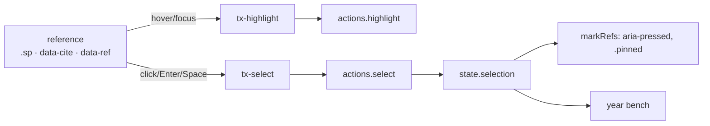

# 0012. Linked references

Status: accepted, 2026-10-04 (the user's request after testing canvas-ui)

## Context

The dotted story phrases lit up their beads on hover through `wireHoverHighlight` (`ui/highlight.js`), wired separately in each view. The period chips in the year story carried no payment ids and lit nothing. Clicking any of them didn't keep what it stood for, so the beads went dark as soon as the pointer left. The person asked for hover to highlight, click to keep the selection, and for this to be one reusable behaviour.

## Decision

- **One delegated controller,** `wireLinkedRefs(host, runtime)` in `components/linked-ref.js`, for anything that stands for a set of payments:
  - a dotted phrase (`.sp[data-ids]`);
  - a citation (`[data-cite]`);
  - an element marked `data-ref`, which covers period chips in the story and the names on `<tx-period-strip>` (`data-period-ref`, resolved from the period's **id** by `periodPayments` in `transactions/period-stats.js`, since several periods can share a name), thread names (`data-ids`) and bench rule lines.
- **Behaviour:**
  - hover and focus light the payments up through `tx-highlight`, and leaving restores what was lit before;
  - a click, Enter or Space pins them through `tx-select`, which `main.js` answers with `actions.select`, the existing selection path;
  - the pin stays after the pointer leaves, and the year's bench shows it like any selection;
  - clicking again or Escape releases it, and pinning something else replaces it;
  - a pinned reference has `aria-pressed="true"` and the `.pinned` look;
  - `data-ref="hover"` lights up without pinning, for busy-stretch chips (their click names them) and bench rule lines (their click selects the line for editing).
- **Hosts:** `tx-year`, `tx-one-month`, `tx-month` and `<tx-period-strip>` wire it, and the old panel's inspector wires it with `{ pin: false }`. `wireHoverHighlight` is deleted.
- **Guardrail:** "hover highlighting goes through linked references" fails on a `mouseover`, `mouseenter`, `pointerover`, `pointerenter` or `focusin` listener in `components/` that lights up payments anywhere but `linked-ref.js`.

## Consequences

- Every reference behaves the same, and a new view gets the behaviour by calling `wireLinkedRefs`.
- Pinning refreshes the view, which redraws it. Focus is put back on the same reference (matched by its class and what it stands for), and a period name's edit card reopens after the refresh.
