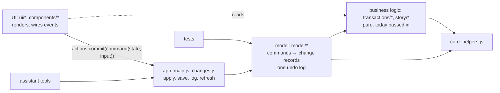

# 0013. UI, business logic and the model

Status: accepted, 2026-10-04 (the user's direction after the architecture audit: "separate the ui code from the pure business logic, ideally the model as well")

## Context

At 7e75ac5, saved state was written directly in 14 files, 50 times (rule 1's pattern below), not counting writes to an item's properties such as `p.name = …`. `ui/` factories and components each assigned `state.notes`, `state.periods` or `state.lenses` and called `save` themselves. Each kept its own undo: a closure in a toast, `previous` maps in the chat's reply, a spliced index. The canvas rewrites (`tx-year-ask.js`, `tx-year-saved.js`, `tx-year-bench.js`) added writers of their own, without the Undo the old code had (AUDIT.md). The assistant could only do what its own tool code reimplemented. Components also computed figures over transactions themselves.

## Decision

Three kinds of code, each with its own rules.



- **UI** (`ui/`, `components/`) renders and wires events. It calls a model command for every change to saved state and doesn't compute over money.
- **Business logic** (`transactions/`, `story/`) stays pure. These are functions from data to data, with `today` passed in.
- **The model** (`model/`) is the state's saved fields plus every command that changes them. A command is a pure function `command(state, input)` that:
  - validates its input, throwing `CommandError` with a sentence the person or the assistant can act on;
  - leaves `state` untouched;
  - returns a **change record**, or `null` when nothing would change.

  ```js
  { command: "tag", summary: "Added #trip on 2 transactions.",
    patches: [{ field: "notes", entries: { t1: [before, after] } },     // map entries
              { field: "periods", items: { p1: [before, after, i, j] } }, // items by id
              { field: "rules", lines: { at, before: [..], after: [..] } }] } // a run of lines
  ```

  A command gives a list or a text as `value: [before, after]`, and `record()` turns it into `items` (only the items added, removed or changed, by id, with their places) or `lines` (the one run of lines that changed). So undoing an earlier record reverses only what it changed and keeps later edits to anything else, as 8d87cd2's Undo did. If the same entry, item or lines were changed again since, undo is refused with a sentence (a `CommandError`, shown by `changes.js` through `io.tell`) and the record stays undoable, rather than throwing the later edit away. `applyChange` works out every field before setting any, so a refused record changes nothing (C1-VERIFY finding 1).

  `applyChange(state, record)` makes the change, and `applyChange(state, record, { undo: true })` reverses it. `invert(record)` gives the record that undoes it. Records hold copies, so a later edit can't change what undo puts back.

- **One undo log.** `changes.js` (app) provides `actions.commit(record, { refresh })` and `actions.undo(record)`. `commit` applies the record, saves the documents it touches (`keysOf`, from `KEY_OF`, checked against `documents.js`), logs it and refreshes. `undo` takes a record off the log and applies its inverse. A toast's Undo, the chat's Undo and the tests all go through it. `main.js` provides both, so the registry's action cycle doesn't grow.

### Layers

`model` is its own layer in `LAYERS`, at rank 2 beside persistence and platform. It is in the `PURE` set, so it may use no DOM, storage, network or ambient clock: a command that creates something takes its `id` from the caller. Imports point inwards:

```text
ui (4) → app (3) → model (2), persistence/platform (2) → domain (1) → core (0)
```

The model may import only `model/`, the domain and the core. It may not import persistence, even though that sits at the same rank. A test checks this.

### Commands so far

| Command                                                     | Field        | Called from                                                                       |
| ----------------------------------------------------------- | ------------ | --------------------------------------------------------------------------------- |
| `tag`, `untag`                                              | `notes`      | `ui/tags.js` `bulkTag`                                                            |
| `setNote`                                                   | `notes`      | inspector note box                                                                |
| `renameMerchant`                                            | `names`      | inspector name box                                                                |
| `setTransfer` (label a transaction)                         | `transferOv` | inspector transfer toggle                                                         |
| `addPeriod`, `editPeriod`, `removePeriod`                   | `periods`    | `ui/periods.js`, timeline drag, `<tx-period-strip>` drag, nudge and rename        |
| `setRules`, `addToThread`, `setBudget`, `clearBudget`       | `rules`      | Threads editor, Keep suggestion, inspector "Thread these", budget lines and drags |
| `addLens`, `editLens`, `removeLens`, `restoreStarterLenses` | `lenses`     | `ui/lenses.js`, `ui/lens-editor.js`, More → reset lenses                          |
| `runLens` (a query: no record)                              | none         | the assistant's tools next (C2)                                                   |
| `addReport`, `removeReport`, `restoreReport`                | `reports`    | `ui/reports.js`                                                                   |

### Measurable rules (tests/architecture.test.js)

1. **No saved-state writes outside the model.** Outside `model/`, `documents.js`, `backup.js` and `main.js` (which load and restore whole documents), the test fails on:
   - assignment, `push`, `splice`, `unshift`, `pop`, `shift` or `delete` on `state.(notes|names|transferOv|rules|periods|lenses|reports|answers|merchantAnswers)`;
   - a write inside one (`state.periods[0].name = …`) and `Object.assign(state.notes, …)`;
   - writes, mutating methods or `Object.assign` within 30 lines on a name declared as such a field, an item `.find()`-ed in one, or a field destructured from `state` (`const { periods } = runtime.state; periods.push(p)`).

   The allowlist counts what each file has left and names C4.

2. **No business logic in the UI.** In `ui/` and `components/`, there is no `reduce` whose callback sums `.amount`, and no `filter`, `sort` or `reduce` on a transaction list (`txns`, `allTxns`, `derived.txns`, `derived.expected`). The allowlist counts what is left and names C4.
3. **The model is pure** (the `PURE` scan) and imports only the model, the domain and the core.

## Consequences

- The assistant's tools (C2) can call the same commands as the UI, so it can do everything the person can, with the same Undo.
- Commands replace a field rather than mutating it, so the arrays in `state.periods` and `state.lenses` are new objects after every commit. Code that holds a period or lens across an `await` must look it up again by id. `ui/reports.js` `runReport` does this.
- A drag still moves a period live, as a preview. When the drag ends it puts the dates back and commits one `editPeriod`, so the undo log holds one record per drag rather than one per pixel.
- Rule 1 is a measure of the common shapes, not a proof. It doesn't follow an item passed to a function that writes it (the period drag's `dragTo(p, …)` in `transactions/period-drag.js`, which the C4 entry for `ui/timeline-drag.js` covers), an alias passed on more than 30 lines later, or an item reached through a loop variable. Reviews check those. Rule 2 is a measure, not a proof: it catches the common shapes of computing over money in the UI.
- Question answers (`answers`, `merchantAnswers`) have no commands yet. Their writes are allowlisted for C4.
