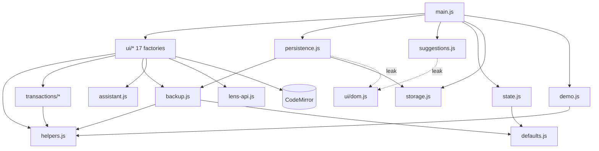
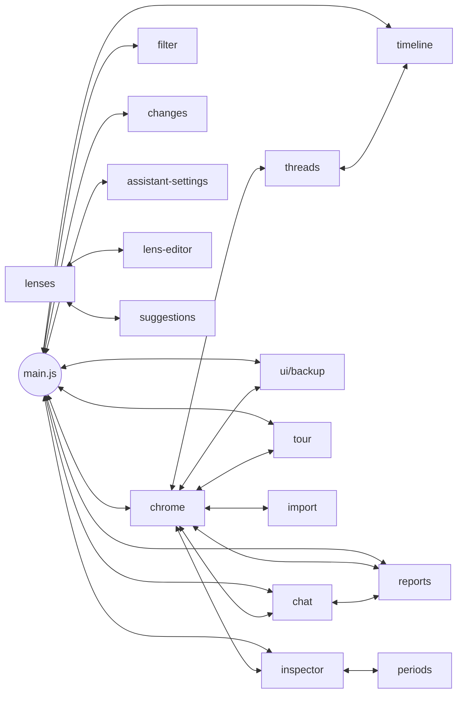

# Architecture review

Review of branch `architecture` at `d6b142d` (the tip of `main`), 4 October 2026. Baseline: `npm ci && npm run check` passes (24 of 24 tests, build OK).

## Verdict

The code is not a mess, but it has one structural weakness that will get worse as features land.

The domain core is in good shape. `transactions/derive.js`, `rules.js`, `transfers.js` and `changes.js` are pure functions over a plain state object, `deriveTransactions` takes an injectable `today`, and the backup and restore path is careful and well tested. The static import graph has no cycles.

The UI layer is the problem. Its 18 modules each add functions to one shared `actions` object and call each other through it. That hides a dependency graph in which **every UI module, `suggestions.js` and `main.js` sit in one strongly connected cycle**. Three things that each new feature has to touch are spread across many files, held together only by convention, and untested:

- the shared mutable `state`, written from 16 files;
- the saved-document keys, defined in six places;
- the lists of what to re-render after a change, kept by hand in four places.

The story-first work (new panels, plus `answers` and `merchantAnswers` documents) lands exactly on those three things.

Findings are ranked by risk to future change:

| #   | Finding                                                                                          | Risk        |
| --- | ------------------------------------------------------------------------------------------------ | ----------- |
| 1   | `actions` is an implicit service locator, and the real graph is one 18-module cycle              | High        |
| 2   | The saved-document schema is spread over six files and has already drifted                       | High        |
| 3   | Re-render lists are kept by hand in four places                                                  | High        |
| 4   | Domain logic lives in UI modules, and 67% of the code is never loaded by a test                  | Medium–high |
| 5   | One mutable state bag is written from 16 files                                                   | Medium      |
| 6   | `renderTimeline` and `ui/chat.js` are too big and mix concerns                                   | Medium      |
| 7   | The pure layers leak: `helpers.js`, `transactions/import.js`, and root modules importing `ui/`   | Medium      |
| 8   | Escaping is mostly disciplined but relies on validation done elsewhere; listener wiring is mixed | Medium–low  |
| 9   | Lens code from an imported backup runs with full page access                                     | Medium–low  |
| 10  | The single file still loads fonts and the spreadsheet reader from CDNs                           | Low–medium  |
| 11  | Small duplications                                                                               | Low         |

## How the evidence was gathered

Every `*.js` file at the root and in `transactions/`, `ui/`, `scripts/` and `tests/` was read, plus `index.html`, `styles.css` and the Pages workflow. Two throwaway Node scripts built the graphs (kept in the job outbox as `graph.mjs` and `actions.mjs`, and to be turned into guardrail tests in the next step):

```sh
$ node graph.mjs . $(git ls-files '*.js' '*.mjs')     # static ES imports
CYCLES: none
$ node actions.mjs main.js persistence.js suggestions.js ui/*.js
PROVIDED KEYS: 76
DUPLICATE PROVIDERS: []
USED WITHOUT PROVIDER: {}
PROVIDED BUT NEVER CALLED: lensLib
actions file edges: 95  call sites: 264
```

`actions.mjs` treats the keys in each `create*()` factory's `return { … }` as provided, and each `actions.X` reference as a use. It then computes strongly connected components over the file-to-file edges.

## Structure today

### Static imports (acyclic)



### Runtime calls through `actions` (one cycle)

Each arrow below is a pair of modules that call **each other** through `actions`. All 18 nodes form a single strongly connected component.



## Findings

### 1. `actions` is an implicit service locator, and the real graph is one cycle (High)

`main.js:27-50` builds a single object, and every factory both extends it and receives it:

```js
const actions = {
  derive() {
    runtime.derived = deriveTransactions(runtime.state);
  },
};
Object.assign(actions, createPersistence(runtime, actions));
Object.assign(actions, createFilter(runtime, actions));
// … 16 more …
Object.assign(actions, { refresh: renderAll, renderAll, refreshSoon }); // main.js:194
```

Evidence:

- **The import graph hides the coupling.** `ui/chrome.js` imports only `backup.js`, `helpers.js`, `ui/dom.js` and `defaults.js`. Through `actions`, though, it calls into 14 modules: timeline, tour, assistant-settings, persistence, chat, reports, import, main, threads, inspector, lenses, suggestions, ui/backup and periods.
- **There is one strongly connected component of 18 files** (all of `ui/*` except `dom.js`, plus `suggestions.js` and `main.js`). Only `persistence.js` sits outside it, as a pure provider. 95 file-to-file edges and 264 call sites run through one untyped object.
- **Nothing checks providers.** Today every one of the 76 keys has exactly one provider, and no `actions.X` lacks one. That holds only because nobody has made a mistake yet. A typo such as `actions.renderLense()` throws only when that code path runs, and no test loads these modules. `lensLib` is provided but never called through `actions`; it exists only for `tests/lens-api.test.js`.
- **Name collisions overwrite silently.** `Object.assign` lets a later factory replace an earlier key with no warning. For example, a story-first `ui/month.js` exporting `render` or `openTab` would replace chrome's version.
- **Startup ordering is safe now, by accident.** No factory calls `actions.X` while it is being built (a grep for `actions.` at factory top level finds nothing), so the `Object.assign` order does not matter. `refresh`, `renderAll` and `refreshSoon`, however, are only attached at `main.js:194`, after every factory. A future factory that calls `actions.refresh()` during construction, or a module that subscribes early, would fail.

Why it matters for change: to know what a function affects, you have to grep the whole `ui/` tree for `actions.name`. Contributors and agents alike will add new cross-calls freely, because nothing makes them visible.

### 2. The saved-document schema is spread over six files and has already drifted (High)

No single module owns "what is saved, under which key, in what shape". This is where each key is written and read:

| Key                                            | Written by                                                                                          | Read by                                        |
| ---------------------------------------------- | --------------------------------------------------------------------------------------------------- | ---------------------------------------------- |
| `rules` `{text}`                               | `ui/chrome.js:104,135`, `ui/inspector.js:275`, `ui/timeline.js:515`, `main.js:133`, `backup.js:254` | `main.js:143`                                  |
| `notes` `{map}`                                | `ui/chat.js:151,684`, `ui/inspector.js:196`, `ui/tags.js:64,82`, `main.js:134`, `backup.js:255`     | `main.js:144`                                  |
| `names` `{map}`                                | `ui/chat.js:200,670`, `ui/inspector.js:183`, `backup.js:256`                                        | `main.js`                                      |
| `transfers`, `dismissed`, `adapters`           | `ui/inspector.js:12`, `ui/changes.js:54,75`, `ui/import.js:44`, `backup.js`                         | `main.js`                                      |
| `periods`, `reports`, `lenses`, `view`, `chat` | `persistence.js:52-104`, `backup.js:251-267`                                                        | `main.js`                                      |
| `batch_<id>_<n>`                               | `backup.js:227` via `persistence.js:41`                                                             | `main.js:163-180`                              |
| `demo` `{version}`                             | `main.js:132`                                                                                       | never read (it only makes the store non-empty) |
| `workspace` `{demo}`                           | `backup.js:253` only                                                                                | `main.js:141`                                  |
| `transactions-demo-ai-settings`                | `ui/assistant-settings.js:17` (raw `localStorage`)                                                  | `ui/assistant-settings.js:9`                   |
| `transactions-tour-seen`                       | `ui/tour.js:192` (raw `localStorage`)                                                               | `ui/tour.js:242`                               |

There are also two separate loaders with different rules. `parseBackup` (`backup.js:51-225`) validates every field. Boot (`main.js:141-161`) accepts whatever is stored, with its own `?.`/`Array.isArray` checks.

The drift this already causes:

- **`isDemo` can only become `false` by restoring a backup.** The seed writes a `demo` document (`main.js:132`), but boot reads `workspace.demo` (`main.js:141`), and only `restoreBackupDocuments` ever writes `workspace`. So a workspace that started as the demo keeps `isDemo: true` (`state.js:6`), and keeps the "Demo · a fictional year" header (`ui/chrome.js:17`), however many real statements are imported. This needs confirming in the browser before anyone fixes it; it is recorded here as a symptom of the missing owner.
- **`view` has two shapes.** `saveView` writes `{parked, panel}` (`persistence.js:73-78`), while backups write all of `state.view`, including the transient `showParked` (`backup.js:21,263`).
- **Story-first will widen this.** Adding `answers` and `merchantAnswers` currently means editing `state.js` (default), `main.js` (load), `persistence.js` or a literal `saveSoon("answers", …)` (save), and `backup.js` in three places: `createBackup`, `parseBackup` and `workspaceDocuments`. Nothing checks that those places agree. A key that is backed up but not loaded at boot is lost silently on the next reload.

### 3. Re-render lists are kept by hand in four places (High)

Each of these places decides for itself which views to refresh after state changes:

```js
// main.js:53-71 renderAll: chrome, filter bar, parkbar, changes, reports,
// timeline, editor, inspector, lenses, askCtx, log, then reports again
if ($("#pane-reports").classList.contains("on")) actions.renderReports(); // :63
// …
if ($("#pane-reports").classList.contains("on")) actions.renderReports(); // :70 (duplicate)

// main.js:186-193 refreshSoon: changes, filter bar, timeline, editor, lenses (no inspector, no chrome)
// ui/chrome.js:101-111 rules input: timeline, editor, inspector, renderLensesSoon, caretHighlight
// ui/filter.js:68-77 filter redraw: filter bar, timeline, editor, inspector, lenses
```

On top of these, 34 call sites in `ui/` and `suggestions.js` invoke individual renders such as `actions.renderTimeline()` and `actions.renderInspector()` directly. A new panel, such as story-first's month summary or questions, has to be added to each list. If it is left out of one, the panel shows stale data only on that path: for example after typing in the filter, but not after an edit through `refreshSoon`. Nothing will report it. The duplicated `renderReports` at `main.js:63` and `:70` shows the lists are already edited without a full view of them.

### 4. Domain logic lives in UI modules, and 67% of the code is never loaded by a test (Medium–high)

```sh
$ node --test --experimental-test-coverage tests/*.test.js   # files loaded by tests
backup.js 98.8% · derive.js 91.9% · rules.js 85.6% · transfers.js 100% · import.js 40.0% · ui/lenses.js 31.6%
$ wc -l main.js persistence.js suggestions.js downloads.js ui/{assistant-settings,backup,changes,chat,chrome,filter,import,inspector,lens-editor,periods,reports,tags,threads,timeline,tour}.js | tail -1
  4633 total        # of 6925 lines of application JS; never imported by any test
```

The pure core is well covered. The untested 4,633 lines are not only DOM glue, though. They contain rules that would be cheap to test if they were pure:

- **Editing the rules text** happens in three UI modules, outside `transactions/rules.js`. `ui/timeline.js:501-517` (`setBudget`) rewrites `[budget N]` with a regex. `ui/inspector.js:243-296` (`addToThread`) inserts pattern lines. `ui/chrome.js:132-138` accepts a preview.
- **Assistant tools** live in `ui/chat.js:6-41` (`filterTxns`), `:102-205` (`applyNoteChanges`, `applyNameChanges`, including their undo records), `:333-367` (`save_period`) and `:411-434` (`totals`). These run against the person's data with write access and have no tests.
- **Period statistics** (`ui/periods.js:7-24` `periodStats`), **tag parsing and bulk tagging** (`ui/tags.js:10-92`), **budget layout per month** (`ui/timeline.js:265-300`) and **report staleness** (`ui/reports.js:6-9`) are pure computations sitting inside closures that need a DOM.
- **Prompt builders** (`ui/chat.js:530-561` `buildIntro`, `ui/periods.js:133-159`, `suggestions.js:42-54`) decide what data leaves the browser. This matters for constitution goals 4 and 5 and anti-goal 3, and they cannot be tested in isolation.

### 5. One mutable state bag is written from 16 files (Medium)

`createRuntime()` (`state.js:3-38`) returns one object that mixes saved data (`rules`, `notes`, `periods`, …), session view state (`selection`, `highlight`, `periodSel`, `statement`, `query`, `range`, `budgetDrag`, `storyEdit`) and in-flight flags. Any module assigns to it:

```sh
# assignment/push/splice/add/delete/clear sites on state.*, per file
30 ui/timeline.js 24 ui/chat.js 19 ui/inspector.js 14 main.js 13 ui/chrome.js 12 ui/periods.js
9 ui/tour.js 6 ui/reports.js 6 ui/changes.js 5 ui/lenses.js 4 ui/tags.js 3 ui/filter.js ...
```

The consequences:

- **The "clear the focus" sequence is hand-written 11 times** (`state.periodSel = null` together with `selection`, `highlight` and `statement`), for example at `ui/timeline.js:743-747`, `ui/chrome.js:213-216` and `ui/chat.js:705-708`. Each copy clears a slightly different subset.
- **Saved objects carry transient fields.** `ui/reports.js:41-43` sets `r.running`, `r.draft` and `r.error` on the same object that `saveReports` serialises. Only the whitelist at `persistence.js:58-66` keeps them out of storage.
- **A save is a separate, forgettable step after every mutation.** For example, `ui/periods.js:69-72` mutates `p.name` and then calls `savePeriods()`. Lens title edits (`ui/lenses.js:233`) and chat undo (`ui/chat.js:664-671`) each repeat the pattern of mutating, saving the right key with the right shape, then refreshing.

### 6. `renderTimeline` and `ui/chat.js` are too big and mix concerns (Medium)

| Module           | Lines | What is mixed                                                                                                                                                                                                                                                                         |
| ---------------- | ----: | ------------------------------------------------------------------------------------------------------------------------------------------------------------------------------------------------------------------------------------------------------------------------------------- |
| `ui/timeline.js` |   949 | `renderTimeline` alone is `:52-430`, 378 lines. It does domain extent, period lane packing, row layout, budget bars, bead lane packing, arcs and SVG strings in one function. Pointer handling for 5 drag modes is at `:549-845`, and budget editing of the rules text at `:476-517`. |
| `ui/chat.js`     |   756 | Tool schemas, tool implementations, the system prompt, a markdown renderer (`md`, also used by periods and reports), the conversation log renderer, and a 100-line click handler (`:655-752`).                                                                                        |
| `main.js`        |   196 | Composition root, render orchestration and the whole boot sequence, including the schema mapping from finding 2.                                                                                                                                                                      |

The size of `renderTimeline` is a direct risk. During a budget or period drag, the whole SVG is rebuilt on every `pointermove` (`ui/timeline.js:585,604`). Its layout maths cannot be tested because it is interleaved with string building.

### 7. The pure layers leak (Medium)

Charter decision 3 says `transactions/` (and `story/`) use no DOM, `window`, `document` or storage. Today:

- **`transactions/import.js` needs a browser.** It uses `DOMParser` (`:5`, `:113`), `window.XLSX` (`:183`) and `File.arrayBuffer` (`:171`). The pure parts (`csvMatrix`, `applyMapping`, `guessHeaderRow`) share a file with the browser-only readers. This is why its coverage is 40%.
- **`helpers.js` mixes concerns.** It holds the DOM query `$` (`:1`) and the module-load clock `TODAY = isoOf(new Date())` (`:28`) next to pure formatting. `transactions/*`, `backup.js` and `demo.js` all import it. `deriveTransactions` defaults `today` to `TODAY` (`derive.js:7`), and `backup.js:10,124` stamps `TODAY` with no way to inject a date.
- **Root modules import `ui/`.** `persistence.js:2` and `suggestions.js:2` import `toast` from `ui/dom.js`, and `suggestions.js` also uses `$` (`:39`, `:62`). So "root" is not a layer below `ui/`. It is a mixed bag.

### 8. Escaping is mostly disciplined but relies on validation done elsewhere; listener wiring is mixed (Medium–low)

The `innerHTML` and template-string rendering is consistent. Free text goes through `esc` (93 calls across `ui/`), and `md()` escapes before it adds markup (`ui/chat.js:453-471`).

One piece of text reaches HTML unescaped: the assistant's label, `actions.AI()`, which is interpolated raw at 14 sites (for example `ui/chat.js:476,506` and `ui/lenses.js:120`). For a custom provider, the label is the host name, and when `new URL()` throws, `assistant.js:43-50` falls back to the raw string the person typed:

```sh
$ node -e '…same normBase/host logic as assistant.js with base "foo<b>x</b>"…'
https://foo<b>x</b>
```

Only the person can type that value into their own settings, so the risk is low. Still, it shows that escaping depends on each call site remembering to escape.

However, ids and colours are interpolated raw, for example `data-pid="${selP.id}"` and `style="--pc:${p.color}"` (`ui/timeline.js:172,236`), `data-lens="${l.id}"` (`ui/lenses.js:119`), and `value="${p.start}"` (`ui/periods.js:35`). These are safe only because `parseBackup` checks them against `/^[A-Za-z0-9_-]+$/` and `/^#[0-9a-f]{3,8}$/i` (`backup.js:33,176`), and because the app generates the other values itself. That is a rule enforced in another file. The assistant's `save_period` tool (`ui/chat.js:333-367`) does not validate `rename_to` or the id it generates; both happen to be safe today.

Event wiring follows three styles:

- delegated `closest()` handlers on a stable host (`#tl`, `#log`, `#lenses`, `#reports`);
- per-render `addEventListener` on freshly created nodes (`ui/inspector.js:171-198`, `ui/periods.js:69-111`, `ui/filter.js:41-58`);
- `window`/`document` listeners from four modules (`ui/chrome.js:67-84,150,200`, `ui/filter.js:107`, `ui/assistant-settings.js:49`, `ui/tour.js:231-233`).

Keyboard handling is therefore split: Escape in chrome, `/` in filter, Delete in chrome, and capture-phase keys in the tour. A new global shortcut has to be checked against all of them.

### 9. Lens code from an imported backup runs with full page access (Medium–low)

`runLens` evaluates saved lens code with `new Function("txns", "lib", code)` (`ui/lenses.js:60`) on the main thread. `renderLenses` runs every lens on each render. `parseBackup` checks only that `code` is a string (`backup.js:150-157`). Importing a backup file someone else made therefore runs their JavaScript in the page. That code can read `localStorage`, including the OpenAI-compatible API key stored under `transactions-demo-ai-settings`, and can call `fetch`.

Lenses being code is a product decision, and this isn't a bug. It is, however, a trust boundary that nobody has documented. Any future sharing feature (shared lenses, shared backups) would cross it.

### 10. The single file still loads fonts and the spreadsheet reader from CDNs (Low–medium)

The build is simple and sound. `scripts/build.mjs` bundles `main.js` with esbuild, inlines it and `styles.css` into `index.html`, escapes closing tags, and writes `transactions.html` and `dist/transactions.html`. `tests/build.test.js` checks that the output is deterministic and parses.

Two runtime network dependencies remain, and the test pins them as expected:

```html
<!-- index.html:9-10 -->
<link
  href="https://fonts.googleapis.com/css2?family=Frank+Ruhl+Libre…"
  rel="stylesheet"
/>
<script src="https://cdnjs.cloudflare.com/ajax/libs/xlsx/0.18.5/xlsx.full.min.js"></script>
```

Offline, the fonts fall back, and `.xlsx` import fails with the message at `transactions/import.js:183-186`. This bends anti-goal 5 ("works offline"). The script tag also has no `integrity` attribute. Changing either is an escalation item under the constitution, because it affects network behaviour or bundle size.

Bundle make-up, measured with an esbuild metafile: 647 KB of JS. Of that, 152 KB is app code and about 430 KB is CodeMirror plus Lezer for the lens editor. The built HTML is 699,286 bytes, so the constitution's 100 KB growth budget is measured against roughly 700 KB.

### 11. Small duplications (Low)

| Duplicated logic                                                              | Sites                                                                                                                        |
| ----------------------------------------------------------------------------- | ---------------------------------------------------------------------------------------------------------------------------- |
| Look up a thread by name: `runtime.derived.R.threads.find(t => t.name === …)` | `ui/timeline.js:136,259,491,632,830`, `ui/inspector.js:102`, `ui/threads.js:70`                                              |
| New lens id `"l" + Date.now().toString(36)`                                   | `ui/chat.js:736`, `ui/lenses.js:193,216`                                                                                     |
| New period (id scheme and palette colour), done two different ways            | `ui/periods.js:203-224`, `ui/chat.js:345-356`                                                                                |
| Currency symbol map                                                           | `ui/timeline.js:443`, `ui/changes.js:8`                                                                                      |
| `[data-cite]` click: select, highlight, refresh                               | `ui/chat.js:718`, `ui/inspector.js:18`, `ui/reports.js:127`                                                                  |
| Count of covered statement months                                             | `ui/timeline.js:190,481`, `ui/periods.js:121`                                                                                |
| Tag-boundary regex                                                            | `ui/tags.js:10`, `transactions/derive.js:236`                                                                                |
| Fallback values that hide missing data (anti-goal 2)                          | `ui/timeline.js:484` `niceBudget(avg) \|\| 500`, `backup.js:174` default period colour, `ui/periods.js:70` "Untitled period" |

## What is working and should be kept

- **Pure derivation with injected time.** `deriveTransactions(state, { today })` and `createDemoData(today)` make the demo-year tests deterministic. New `story/*` modules should follow the same pattern.
- **Storage behind an interface.** `localBackend` and `dbBackend` (`storage.js`) take their dependencies as arguments (`storage`, `db`, `onError`) and are tested with fakes. `restoreBackupDocuments` verifies writes and rolls back on failure (`backup.js:287-326`).
- **Contract tests.** `tests/lens-api.test.js` ties the documented lens API to the real objects, and `tests/build.test.js` pins the single-file output.
- **One factory shape.** Every UI module is `createX(runtime, actions) → { renderX, wireX, … }`. That is easy to read, and it gives the refactors in the backlog a clear place to start: the factories can receive explicit dependencies instead of the whole `actions` object.

## Implications for the target design

These are the problems the target design (`docs/architecture.md`) and the guardrails need to address. Solutions belong there and in the backlog, not here.

1. Make the module graph explicit: either named dependencies per factory or a checked registry, so that cycles and missing providers are visible.
2. Give saved documents one owner, so that adding `answers` means a change in one place plus a test.
3. Replace hand-kept render lists with a single "state changed" path that every view subscribes to.
4. Move rules-text editing, assistant tools, period statistics and tagging into pure modules with demo-year tests.
5. Turn the import-graph script into a test that enforces charter decision 3, with commented allowlist entries for today's violations from finding 7.
