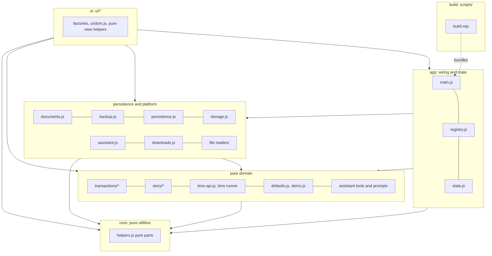
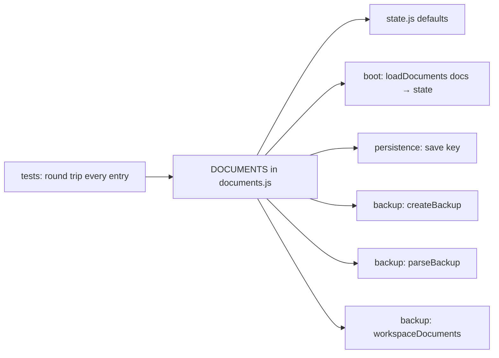
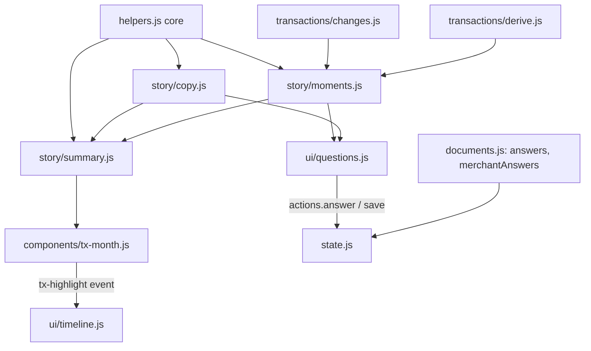

# Target architecture

The architecture that new code in Transactions follows, and that existing code moves towards one step at a time. It answers the findings in [the architecture review](architecture-review.md); the reasons for each choice are in the [ADRs](adr/). 4 October 2026.

## In one page

- **Five layers, one direction.** Dependencies point inwards: `ui → app → persistence/platform → domain → core`. The pure layers (`core`, `transactions/`, `story/`) never touch the DOM, `window`, storage or the clock. A Node test reads the import graph and fails on a wrong-way import ([ADR 0001](adr/0001-layers-and-dependency-direction.md)).
- **Layers are assigned by a table, not by folders.** Today's root files keep their paths until it is cheap to move them, so the rules apply now without conflicting with parallel work.
- **UI modules declare a contract.** Each one exports `contract = { name, create, provides, requires, renders }`. `main.js` builds `actions` from those contracts and refuses to start on a duplicate or missing function. Each module receives only what it declared ([ADR 0002](adr/0002-declared-module-contracts.md)).
- **One registry of saved documents.** `documents.js` defines every saved key, its shape, its validation and its backup name. Boot loading, saving and backups are all derived from it ([ADR 0003](adr/0003-one-registry-of-saved-documents.md)).
- **One refresh path.** After a change, code calls `actions.refresh()` (or `refreshSoon()` while typing). That re-derives and calls every registered render. Modules call each other's commands, never each other's renders ([ADR 0004](adr/0004-one-refresh-path.md)).
- **Template strings stay, escaped by default.** New code builds HTML with an escaping `html` tag and wires events once, by delegation on a stable host ([ADR 0005](adr/0005-escaped-templates-and-delegated-events.md)).
- **Pure logic is tested in Node against the demo year; UI is checked in headless Chrome** ([ADR 0006](adr/0006-testing-pure-logic-and-the-ui.md)).
- **One HTML file, no backend, and network access only from named adapters**, each run only when the person asks ([ADR 0007](adr/0007-single-file-no-backend-network-boundary.md)).
- **Money carries its statement's currency, with no default and no conversion.** Story code meets money only through `story/currency.js`, one currency at a time ([ADR 0008](adr/0008-statement-currency.md)).
- **UI pieces become plain web components.** Custom elements in `components/`, light DOM, configured by attributes, subscribed to one store (`store.js`), asking for things with events such as `tx-highlight`, and drawing only inside themselves, so a layout is just markup ([ADR 0009](adr/0009-web-components-as-the-ui-boundary.md), section 4a).

## 1. Layers and dependency direction



### What each layer may do

| Layer                        | May import                                                                                                | May use                                                                                                                                                                | Must not                                                                                                       |
| ---------------------------- | --------------------------------------------------------------------------------------------------------- | ---------------------------------------------------------------------------------------------------------------------------------------------------------------------- | -------------------------------------------------------------------------------------------------------------- |
| **core**                     | nothing outside core                                                                                      | pure JS only                                                                                                                                                           | touch the DOM, `window`, storage, `fetch`, or call `new Date()` with no argument (no ambient clock)            |
| **domain**                   | core, domain                                                                                              | pure JS only; time arrives as a `today` argument                                                                                                                       | import persistence, platform, app or ui; touch browser globals                                                 |
| **persistence and platform** | domain, core, same layer                                                                                  | `localStorage` and the `db` capability (storage only); `fetch` (assistant only); `Blob` and `URL` (downloads only); `File`, `DOMParser` and `XLSX` (file readers only) | import app or ui; show UI (report errors through an injected `onError`)                                        |
| **app**                      | everything below                                                                                          | composition, boot, state creation, the refresh scheduler                                                                                                               | contain rendering or domain rules                                                                              |
| **ui**                       | app (`state.js` types, `registry.js`), persistence and platform, domain, core, other `ui/` _view helpers_ | the DOM, through its own pane                                                                                                                                          | import another UI _factory_ module (call it through `actions` instead); use `localStorage` or `fetch` directly |
| **build**                    | Node and dev dependencies                                                                                 | the file system                                                                                                                                                        | be bundled into the HTML                                                                                       |

`tests/` may import any layer, and stub browser globals when it needs to.

### Where today's files belong

The layer of a file is fixed by a table in the guardrail test (`tests/architecture.test.js`), so the rules hold before anything moves. **Target path** is where a file should end up; each move is a backlog item and happens only when it won't collide with parallel work. A moved file leaves a one-line re-export at its old path until its last importer has been updated.

| File today                                 | Layer       | Target path                                                                                     | Notes                                                                                                                                                        |
| ------------------------------------------ | ----------- | ----------------------------------------------------------------------------------------------- | ------------------------------------------------------------------------------------------------------------------------------------------------------------ |
| `helpers.js`                               | core        | `core/format.js`, `core/dates.js`, `core/text.js`                                               | `$` moves to `ui/dom.js`. `TODAY` is replaced by a `today` that `main.js` passes in. `story/*` already imports `helpers.js`, so it remains a re-export shim. |
| `transactions/*.js`                        | domain      | unchanged                                                                                       | Browser-only readers moved to `files.js` (platform; R6, done), which can move to `platform/files.js` later; the pure parsers stay.                           |
| `story/*.js`                               | domain      | unchanged                                                                                       | Planned by story-first.                                                                                                                                      |
| `defaults.js`, `demo.js`                   | domain      | `transactions/defaults.js`, `transactions/demo.js`                                              | Pure data builders; `demo.js` already takes `today`.                                                                                                         |
| `lens-api.js`                              | domain      | `lenses/api.js`                                                                                 | `lensLib`, `publicTxn` and `runLens` moved here from `ui/lenses.js` (R4d, done), which keeps only rendering.                                                 |
| `suggestions.js`                           | split       | prompts → `assistant/prompts.js` (domain); button handlers → `ui/threads.js` and `ui/lenses.js` | Today it imports `ui/dom.js` and uses `$`.                                                                                                                   |
| `ui/chat.js` (tool bodies, `buildIntro`)   | split       | `assistant/tools.js`, `assistant/prompts.js` (domain)                                           | Started (R4b): `assistant/tools.js` has the data tools and the note and name changes, returning new documents and undo records; the UI applies them.         |
| `backup.js`                                | persistence | `persistence/backup.js`                                                                         | Its key lists come from `documents.js`.                                                                                                                      |
| `documents.js` (new)                       | persistence | `persistence/documents.js`                                                                      | See section 3.                                                                                                                                               |
| `persistence.js`                           | persistence | `persistence/store.js`                                                                          | Done (R7): reports through `onSaveError` and `showSaveStatus`, declared in its contract, instead of importing `ui/dom.js`.                                   |
| `storage.js`                               | persistence | `persistence/storage.js`                                                                        | The only place that knows `localStorage` keys and the `db` collection path.                                                                                  |
| `assistant.js`                             | platform    | `platform/openai.js`                                                                            | The only `fetch` in the app.                                                                                                                                 |
| `downloads.js`                             | platform    | `platform/downloads.js`                                                                         |                                                                                                                                                              |
| `state.js`, `main.js`, `registry.js` (new) | app         | unchanged (`main.js` stays the build entry)                                                     |                                                                                                                                                              |
| `ui/*.js`                                  | ui          | unchanged                                                                                       | Large modules split into a factory plus pure view helpers, for example `ui/timeline-layout.js`.                                                              |
| `scripts/build.mjs`                        | build       | unchanged                                                                                       |                                                                                                                                                              |
| `abacus.html`                              | none        | unchanged                                                                                       | The earlier prototype, published as-is and outside the app.                                                                                                  |

### Rules that are new compared with today

1. Domain modules take time as an argument. `deriveTransactions(state, { today })` is the model; a default of `TODAY` is allowed only in a shim, never in new code.
2. A `ui/` factory never imports another `ui/` factory. It may import `ui/dom.js` and pure view helpers such as `ui/timeline-layout.js`.
3. Nothing below the UI layer shows UI. Errors travel up as values or through an injected callback.

## 2. Module contracts

### The shape of a UI module

The factory pattern stays. What changes is that each module also declares what it provides and what it needs:

```js
// ui/example.js: an illustration; ui/questions.js is a real one
import { html } from "./dom.js";

export const contract = {
  name: "example",
  create: createExample,
  provides: ["renderExample", "wireExample", "showExample"],
  requires: ["refresh", "highlight", "openTab", "save"],
  renders: ["renderExample"], // called by refresh(), in registration order
  wires: ["wireExample"], // called once at boot, before data loads
};

export function createExample(runtime, actions) {
  const { state } = runtime;
  function renderExample() {
    /* reads runtime.derived and state; writes only #pane-example */
  }
  function wireExample() {
    /* one delegated listener on #pane-example */
  }
  function showExample(ym) {
    state.exampleMonth = ym;
    actions.refresh();
  }
  return { renderExample, wireExample, showExample };
}
```

### What a module may touch

| May                                                        | Must not                                                                                                                                 |
| ---------------------------------------------------------- | ---------------------------------------------------------------------------------------------------------------------------------------- |
| Read `runtime.state`, `runtime.derived` and `runtime.caps` | Write saved state without saving it. Use the owning module's command, or `actions.save(key)` (section 3).                                |
| Write session state it owns, such as `state.exampleMonth`  | Write session state another module owns. Call that module's command instead, for example `actions.clearFocus()`.                         |
| Write the DOM inside its own pane or dialog                | Write another module's DOM, or call another module's `renderX` (use `refresh()`)                                                         |
| Call functions listed in its `requires`                    | Reach anything else on `actions`. Its `actions` is a view that throws on undeclared names.                                               |
| Do nothing DOM-related while being constructed             | Touch the DOM or `actions` inside `createX()` itself. This keeps every factory constructible in Node, which the contract test relies on. |

### The registry

`registry.js` (app layer) replaced the `Object.assign` chain in `main.js` (R1, done):

```js
// main.js
import { contract as persistence } from "./persistence.js";
import { contract as questions } from "./ui/questions.js";
// …
const MODULES = [persistence, chrome, filter, timeline /* … */, lensEditor];
const registry = createRegistry(runtime, MODULES, {
  derive() {
    /* … */
  },
  redraw,
  refresh,
  refreshSoon: debounce(() => refresh(), 250),
});
const actions = registry.actions;
// at boot: for (const wire of registry.wires) wire();
// on refresh: for (const render of registry.renders) render();
```

`createRegistry` does the following:

1. Calls each `contract.create(runtime, view)`. `view` is a `Proxy` over the shared table whose `get` throws `ui/questions.js did not declare "renderTimeline"` for any name missing from `requires`.
2. Checks that the returned keys equal `provides`, and that no key is provided twice. It throws on a mismatch, so a name collision fails at startup instead of silently overwriting.
3. After all modules are registered, checks that every `requires` entry has a provider.
4. Takes the app-level functions from `main.js` first: `derive`, `redraw`, `refresh` and `refreshSoon`. (`save` belongs to `persistence.js`.)
5. Checks that each module's `renders` and `wires` are among its own `provides`, then freezes the table. It returns the table, the renders in registration order and the wires in registration order.

Because construction is DOM-free, `tests/architecture.test.js` runs the same `createRegistry` in Node against fake runtimes. It also scans each module's source for `actions.X` and checks that every `X` is in that module's `requires`, and that every `requires` entry is used. That scan includes view helpers such as `ui/highlight.js` that the module hands its `actions` to. A typo then fails `npm test` instead of throwing on a click. The test also reports the largest group of modules that reach each other through `actions` (13 of 20 after R1), and fails if it grows past `CYCLE_MAX`.

### Commands, not renders

Cross-module calls are to commands that change state and then call `refresh()`. Today's direct render calls become commands:

| Today                                                                                         | Target                                                                    |
| --------------------------------------------------------------------------------------------- | ------------------------------------------------------------------------- |
| `state.highlight = new Set(ids); actions.renderTimeline()` (lenses, chat, threads, inspector) | `actions.highlight(ids)`, provided by `ui/timeline.js`                    |
| Clearing `selection`, `highlight`, `statement` and `periodSel` by hand (11 sites)             | `actions.clearFocus()` / `actions.select(ids)` / `actions.openPeriod(id)` |
| `saveSoon("notes", () => ({ map: state.notes }))` (5 sites)                                   | `actions.save("notes")`                                                   |

## 3. State and persistence

### Three kinds of state

`state.js` keeps a single plain object (there is no framework). Its fields are grouped and commented by kind:

| Kind        | Examples                                                                                                 | Rules                                                                                                                                                                                                                                           |
| ----------- | -------------------------------------------------------------------------------------------------------- | ----------------------------------------------------------------------------------------------------------------------------------------------------------------------------------------------------------------------------------------------- |
| **Saved**   | `rules`, `notes`, `names`, `periods`, `lenses`, `reports`, `answers`, `merchantAnswers`, `batches`       | Defaults come from `documents.js`. Every change is followed by `actions.save(key)`, normally inside a command. Saved objects carry no transient fields: a running report's status lives in a session map keyed by report id, not on the report. |
| **Session** | `selection`, `highlight`, `periodSel`, `statement`, `query`, `range`, `month`, `storyEdit`, `budgetDrag` | Owned by one module (listed in a comment). Others change it through that module's commands.                                                                                                                                                     |
| **Derived** | `runtime.derived`                                                                                        | Rebuilt only by `actions.derive()`, never mutated by UI code.                                                                                                                                                                                   |

### `documents.js`: one definition per saved key

```js
// documents.js (persistence layer, pure)
export const DOCUMENTS = [
  {
    key: "rules",
    field: "rules",
    wrap: "text",
    backup: "rules",
    check: isText,
  },
  {
    key: "notes",
    field: "notes",
    wrap: "map",
    backup: "notes",
    check: mapOf(isText),
  },
  {
    key: "names",
    field: "names",
    wrap: "map",
    backup: "names",
    check: mapOf(isName),
  },
  {
    key: "transfers",
    field: "transferOv",
    wrap: "map",
    backup: "transfers",
    check: mapOf(isBool),
  },
  {
    key: "dismissed",
    field: "dismissed",
    wrap: "map",
    backup: "dismissed",
    check: mapOf(isBool),
  },
  {
    key: "adapters",
    field: "adapters",
    wrap: "items",
    backup: "adapters",
    check: mapOf(isRecord),
  },
  {
    key: "lenses",
    field: "lenses",
    wrap: "items",
    backup: "lenses",
    check: listOf(isLens),
  },
  {
    key: "periods",
    field: "periods",
    wrap: "items",
    backup: "periods",
    check: listOf(isPeriod),
    delay: 400,
  },
  {
    key: "reports",
    field: "reports",
    wrap: "items",
    backup: "reports",
    check: listOf(isReport),
    delay: 400,
  },
  {
    key: "answers",
    field: "answers",
    wrap: "map",
    backup: "answers",
    check: mapOf(isAnswer),
  },
  {
    key: "merchantAnswers",
    field: "merchantAnswers",
    wrap: "map",
    backup: "merchantAnswers",
    check: mapOf(isMerchantAnswer),
  },
  {
    key: "view",
    field: "view",
    wrap: "self",
    backup: "view",
    check: isView,
    in: (v, state) => ({ ...state.view, parked: v.parked, panel: v.panel }),
    out: (v) => ({ parked: v.parked, panel: v.panel }),
  },
  {
    key: "workspace",
    field: "isDemo",
    wrap: "demo",
    backup: "demo",
    check: isBool,
  },
  {
    key: "chat",
    field: "turns",
    wrap: "turns",
    backup: null,
    check: listOf(isTurn),
  }, // not in backups
];
// Statements are chunked into batch_<id>_<n> documents; BATCH_CHUNK_SIZE and batchDocuments stay in backup.js.
```

Everything else is derived from this list:



- **Loading at boot** goes through the same `check` functions as `parseBackup`. A document that fails its check is reported by name (in a toast and the console) and left untouched in storage. `actions.blockSaves` stops the session from saving over it. It is not silently replaced by a default (constitution anti-goal 2).
- **Optional fields of an entry.** `in(value, state)` turns a checked stored value into state, `out(value)` drops transient fields before saving (reports, chat turns, the view), `older()` gives the value for a backup made before the field existed, and `label` names the field in an invalid-backup message.
- **The planned documents.** `answers` is `{ [momentId]: { status: "answered" | "skipped", choice?, note?, created?: { periodId?, noteIds? }, at? } }`. `merchantAnswers` is `{ [merchantKey]: { choice, action?, at? } }`. Their shapes match the checks story-first added to `parseBackup`, which move into `isAnswer` and `isMerchantAnswer`.
- **Compatibility.** Backup field names (`transfers`, `demo`) and storage keys stay as they are, so existing backups and saved workspaces keep loading. The seed's `demo` marker document is read as a legacy marker; new code writes `workspace`. A demo workspace stops being a demo when someone confirms replacing it with their first statements (`withoutDemo` in `documents.js`, the user's decision).
- **Keeping backups in sync.** `tests/documents.test.js` checks the following for every entry: state → backup → `parseBackup` → state is lossless; state → `toDocument` → `loadDocuments` → state is lossless; a workspace saved under the old keys loads unchanged. The guardrail in `tests/architecture.test.js` checks that only `persistence.js` debounces saves, that no module writes a literal key, and that boot uses `loadDocuments`. Adding a document is then one entry plus its check function.

## 4. Rendering conventions

### HTML and escaping

- Views stay as template strings assigned with `innerHTML`, or as SVG strings for the timeline. No framework and no new runtime dependency.
- New code uses the `html` tagged template from `ui/dom.js`. It escapes every interpolated value unless the value is wrapped in `raw()` (for already-built HTML, such as a nested `html` result or `md()` output):

  ```js
  el.innerHTML = html`<button class="cite" data-cite=${t.id}>
    ${t.merchant}
  </button>`;
  // ids, colours and labels are escaped too: no reliance on validation elsewhere
  ```

- Existing code keeps `esc()` until it is touched. When a template is edited, the whole template moves to `html`. The assistant label `actions.AI()` is now escaped everywhere it reaches HTML. A guardrail lists the modules not yet converted, and `.prettierrc` keeps Prettier from reformatting the markup inside `html` templates.
- Text the person wrote is shown apart from generated text and labelled as theirs (constitution, voice). Generated sentences carry `data-ids` so hovering them can highlight their transactions.

### Events

- Each module wires one delegated listener per stable host (its pane, dialog or `#tl`) in `wireX()`, called once at boot. Handlers dispatch on `data-*` attributes with `closest()`, as `ui/lenses.js:130-237` and `ui/chat.js:655-752` already do.
- New code adds no listeners inside `renderX()`. Today's per-render listeners (`ui/inspector.js`, `ui/periods.js`, `ui/filter.js`) are allowlisted until those modules are touched.
- `window` and `document` listeners are allowed only in `ui/chrome.js`, which owns the global keyboard map (Escape, `/`, Delete), and in `ui/tour.js` while the tour is open. Other modules get global keys by adding an entry to chrome's map through a command.

### When to re-render what

| Situation                                                                       | Call                                                                      |
| ------------------------------------------------------------------------------- | ------------------------------------------------------------------------- |
| Any change to saved or shared session state                                     | `actions.refresh()`: re-derives, then calls every registered render       |
| A change while typing (rules, notes, names, story)                              | `actions.refreshSoon()`: the same, debounced at 250 ms                    |
| A new tab, or something that changes no derived data (a saved lens)             | `actions.redraw()`: every registered render, without re-deriving          |
| Lighting up or selecting beads, opening a period, clearing the focus            | `actions.highlight(ids)`, `select(ids)`, `openPeriod(id)`, `clearFocus()` |
| A hot interaction inside one view (dragging a budget or period, moving a lasso) | That module's own render, directly. Only within the module.               |
| An expensive view (lenses run user code)                                        | Its render returns early unless its pane is open                          |

A factory lists its refresh renders in a `renders` array in the object it returns, and `main.js` calls them in registration order. A render checks whether its pane is open (`paneShown` in `ui/dom.js`) and returns early if not; `openTab` calls `redraw()` so the opened pane catches up. The inspector skips a refresh while someone is typing in one of its text fields, so the field keeps its caret. The calls left outside the owning module are deliberate: the timeline relayout when the panel or window changes size, the inspector's period and thread sub-renders, the privacy chip inside `renderChrome`, and the lens view helper `renderView`.

## 4a. Web components

New UI is a custom element in `components/` (layer `ui`), and the `ui/` modules move there in steps R13 to R15. The reasons are in [ADR 0009](adr/0009-web-components-as-the-ui-boundary.md).

| Component        | Attributes                                     | Emits                                | Replaces                                   |
| ---------------- | ---------------------------------------------- | ------------------------------------ | ------------------------------------------ |
| `<tx-month>`     | `month="YYYY-MM"`; without it, the app's month | `tx-highlight` (hover)               | `ui/month.js` (deleted)                    |
| `<tx-questions>` | `limit` (default 5, the rest folded)           | `tx-highlight` via the cards         | the Questions pane of `ui/questions.js`    |
| `<tx-lens>`      | `lens` (a lens id), `titled`                   | `tx-highlight`, `tx-lens-ran`        | each card body in `ui/lenses.js`           |
| `<tx-first-run>` | none                                           | `tx-import-files`, `tx-open-example` | the demo seeded on first load (artboard 1) |

The rules for a component:

- **Its file exports a `contract`** whose `create` captures `runtime` and the scoped `actions`. It provides only `defineX`, listed in `wires`, and has empty `renders`.
- **It subscribes in `connectedCallback`.** `subscribeWhileConnected` in `components/base.js` handles this. It redraws on `"refresh"` and re-marks on `"highlight"`.
- **It draws only into `this`**, with the escaping `html` tag. It skips drawing while it isn't visible.
- **It never calls another component, or a render.** It emits a bubbling `CustomEvent`. `main.js` answers app-wide events such as `tx-highlight`.
- **Its state stays inside itself.** A per-element setting, such as the month shown or whether More questions is open, lives on the element. State shared across the app goes in the runtime's `state`.
- **No ids inside a component.** A host may give the element an id (`<tx-month id="month">` for the tour), but the component never looks one up.

`main.js` shows a prototype layout at `transactions.html#lab`, taken from `<template id="layoutLab">` in `index.html`. It is kept out of the normal app.

**Linked references** ([ADR 0012](adr/0012-linked-references.md)): anything that stands for a set of payments (a dotted phrase, a citation, a period chip, a thread name, a bench line) is wired by `wireLinkedRefs` in `components/linked-ref.js`. Hover and focus light up its payments through `tx-highlight`, and click, Enter or Space pins them as the selection through `tx-select` and `actions.select`. A view adds no hover handlers of its own; a test checks this.

**Named periods have one implementation** ([ADR 0011](adr/0011-one-period-strip.md)):

| Module                          | Layer  | Holds                                                                                                                                                                    |
| ------------------------------- | ------ | ------------------------------------------------------------------------------------------------------------------------------------------------------------------------ |
| `transactions/period-lanes.js`  | domain | `periodLanes`: overlapping periods stack on lanes                                                                                                                        |
| `transactions/period-drag.js`   | domain | `periodAt`, `startDrag`, `dragTo`, `nudge`: hit edges (4px), the 3px click threshold, whole-day moves and resizes over any date-to-x scale; `monthsScale` for the canvas |
| `components/tx-period-strip.js` | ui     | `<tx-period-strip months variant hint stretches>`: the strip, the tints, and every interaction (draw, move, resize, stack, rename, delete with Undo, keys, touch)        |

The year band, the one-month view and `#lab` embed `<tx-period-strip>`, wrapping their thread rows so presses on a period's column move and resize it. The old SVG timeline calls the two domain modules directly. The test "period lanes, drag and the Periods strip have one home each" fails on a second copy.

## 5. Testing conventions

| What                                                                                                   | Where                                                                                                                                 | How                                                                                                                                                                                                                         |
| ------------------------------------------------------------------------------------------------------ | ------------------------------------------------------------------------------------------------------------------------------------- | --------------------------------------------------------------------------------------------------------------------------------------------------------------------------------------------------------------------------- |
| Pure domain (`transactions/`, `story/`, assistant tools and prompts, lens runner, view layout helpers) | `tests/*.test.js`, `node --test`                                                                                                      | Build data with `createDemoData("2026-09-30")` and pass `today: "2026-09-30"`. Never depend on the real clock. Assert facts about named demo cases (the move, the garage repair), not snapshots of whole objects.           |
| Saved documents and backups                                                                            | `tests/documents.test.js`, `tests/backup.test.js`                                                                                     | Round trip every `DOCUMENTS` entry, plus failure and rollback with fake backends, as today.                                                                                                                                 |
| Architecture guardrails                                                                                | `tests/architecture.test.js`                                                                                                          | Import graph against the layer table, module contracts, network and storage boundaries. Each existing violation has a commented allowlist entry naming the backlog item that removes it. The rule itself is never weakened. |
| Build                                                                                                  | `tests/build.test.js`                                                                                                                 | Single file, deterministic, the external URLs pinned.                                                                                                                                                                       |
| UI behaviour                                                                                           | Headless Chrome via `playwright-core`, installed in a temporary directory outside the repo; repo served with `python3 -m http.server` | A scripted walk-through of the changed screen, with screenshots saved to the job's outbox. Not part of `npm test`, because no browser dependency is added to the repo.                                                      |

When a test fails, check whether it also fails on the base commit before changing anything. Assertions are never weakened to make a test pass.

## 6. Constraints: one file, no backend, privacy

- **One HTML file.** `scripts/build.mjs` bundles `main.js` into `transactions.html` and `dist/transactions.html`, both generated files. A new runtime dependency bundled into the HTML, or growth of more than 100 KB over today's 699,286 bytes, is escalated.
- **No backend.** Data lives in the browser (`localBackend`) or in the person's Claude account (`dbBackend`), nowhere else. `storage.js` is the only module that names `localStorage` keys or the `db` collection path. Today `ui/assistant-settings.js` and `ui/tour.js` are allowlisted exceptions.
- **The network boundary.** The only code that may send data is `assistant.js` (`fetch` to the provider the person configured) and calls to `caps.sample` (Claude). Both run only from a handler the person triggered. Nothing is sent on load, on a timer or in a render. The guardrail test fails if `fetch(`, `XMLHttpRequest`, `WebSocket`, `sendBeacon` or `EventSource` appear anywhere else.
- **What is sent.** Prompt and tool payloads are built by pure functions in `assistant/prompts.js` and `assistant/tools.js`. Tests can therefore check what leaves the browser, for example that `buildIntro` without tools includes at most 1,800 transactions and no AI settings.
- **Assistant output** is accepted only when every claim cites transaction ids (constitution, anti-goal 4). Generated summaries fall back to the template text, never to unchecked assistant text.
- **Known exceptions, decided by the user.** The fonts are embedded in the build ([ADR 0010](adr/0010-embedded-fonts.md)), so the page makes no request on load. SheetJS loads only when a spreadsheet is chosen, pinned and hash-checked, from `files.js`. Offline, the person is told to use CSV instead. Lens code runs in a sandboxed frame with no access to the page, its storage or the network, and a 1.5-second limit (`ui/lens-sandbox.js`, ADR 0007). Lenses from an imported backup are labelled as such.

## 7. Where the story-first modules fit



| Module                       | Layer       | May import                                                            | Contract                                                                                                                                                                                                      |
| ---------------------------- | ----------- | --------------------------------------------------------------------- | ------------------------------------------------------------------------------------------------------------------------------------------------------------------------------------------------------------- |
| `story/moments.js`           | domain      | `helpers.js` (pure parts), `transactions/*`                           | Pure: `findMoments(derived, state)` and `applyAnswer(...)`, which returns the changes and an undo record without mutating its inputs. `today` is passed in.                                                   |
| `story/summary.js`           | domain      | core, `transactions/*`, `story/*`                                     | Pure: `summarise(derived, state, month) → Section[]`, where each part carries `txnIds`.                                                                                                                       |
| `story/copy.js`              | domain      | core                                                                  | Pure strings: numbers, dates, plurals, question and privacy wording                                                                                                                                           |
| `story/currency.js`          | domain      | core, `story/copy.js`                                                 | Pure: `currencyView(derived, currency)` and `sectionsPerCurrency(derived, txns, fn)`; amounts are never added or compared across currencies (ADR 0008)                                                        |
| `ui/questions.js`            | ui          | `story/*`, core, `ui/dom.js`                                          | provides `renderQuestions`, `wireQuestions`, `answer`; requires `refresh`, `save`, `addPeriod`, `bulkTag`, `highlight`, `openTab`; renders `renderQuestions`                                                  |
| `components/tx-month.js`     | ui          | `story/*`, core, `ui/dom.js`, `ui/highlight.js`, `components/base.js` | provides `defineMonth` (wires); requires `openQuestions`, `questionCard`, `wireCards`, `askCurrencies`; emits `tx-highlight` (ADR 0009)                                                                       |
| `answers`, `merchantAnswers` | persistence | —                                                                     | Two `DOCUMENTS` entries. Until `documents.js` exists, the hand edits story-first already made (in `state.js`, `main.js`, `persistence.js` and `backup.js`) are correct and covered by `tests/backup.test.js`. |

Retiring "Worth a look" removes `ui/changes.js` and its `renderChanges` and `wireChanges` from the registry. `findChanges` stays in `transactions/changes.js` as an input to moments.

Until the registry exists (backlog R1), the story-first UI modules follow today's `createX(runtime, actions)` pattern and add their `contract` export anyway. It costs nothing, and the registry then picks it up without edits.

## 8. Getting there

Each step is small, keeps behaviour unchanged, and has a backlog entry with the same id in `docs/refactor-backlog.md`. Steps that touch many `ui/` files or `main.js` wait until the current story-first milestone has merged, so the two branches don't conflict.

| Step | Change                                                                                                                     | Answers review finding |
| ---- | -------------------------------------------------------------------------------------------------------------------------- | ---------------------- |
| R1   | `contract` exports, `registry.js`, the scoped `actions` proxy, the contract test (done)                                    | 1                      |
| R2   | Boot, saves and backups derived from `documents.js`; the `demo`/`workspace` key reconciled (done)                          | 2                      |
| R3   | One refresh path: registered renders, `highlight`/`select`/`clearFocus` commands, duplicate `renderReports` removed (done) | 3, 5                   |
| R4   | Pure logic out of UI: rules-text editing, assistant tools, period statistics, tags, the lens runner                        | 4                      |
| R5   | Split `helpers.js`: `$` to `ui/dom.js`, `TODAY` injected (done)                                                            | 7                      |
| R6   | Browser file readers out of `transactions/import.js` (done)                                                                | 7                      |
| R7   | `persistence.js` stops importing `ui/dom.js` (done; `suggestions.js` waits for R4b)                                        | 7                      |
| R8   | `renderTimeline` layout to a pure `ui/timeline-layout.js` (done)                                                           | 6                      |
| R9   | Split `ui/chat.js` into tools, prompts and log rendering (done)                                                            | 6                      |
| R10  | `html` tag and delegated events, adopted as modules are touched (started: tag, guardrail, 5 modules)                       | 8                      |
| R11  | `localStorage` keys into `storage.js` (done)                                                                               | 8                      |
| R12  | Fonts kept external; SheetJS loaded on demand, pinned with an integrity hash (done, the user's decisions)                  | 10                     |
| R13  | Web components for what the Story view needs: timeline, inspector, periods, threads, question cards (ADR 0009)             | user decision          |
| R14  | Web components for the other side-panel panes: lens list, lens editor, reports, Ask, filter                                | user decision          |
| R15  | Web components for the shell and dialogs: chrome, import, backup, assistant settings, tour; `$` retired                    | user decision          |

## 9. Guardrails

`tests/architecture.test.js` runs in `npm test` with Node's test runner. It needs no dependencies: it reads the source files, uses a small scanner that ignores strings, comments and regular expressions, and builds the UI factories in Node.

| Rule                                                                                                                                                | Test                                                          | Allowlisted today                                                                   |
| --------------------------------------------------------------------------------------------------------------------------------------------------- | ------------------------------------------------------------- | ----------------------------------------------------------------------------------- |
| Every app file has a layer in `LAYERS`                                                                                                              | every application file has a layer                            | none                                                                                |
| Imports point to the same or a lower layer; packages only in `ui` and `build`; nothing imports `main.js`                                            | imports point only to the same or a lower layer               | `persistence.js` → `ui/dom.js` (R7)                                                 |
| No `ui/` factory imports another                                                                                                                    | UI factories reach each other only through actions            | none                                                                                |
| No import cycles                                                                                                                                    | there are no import cycles                                    | none                                                                                |
| Core and domain use no `document`, `window`, storage, network, `DOMParser`, `navigator`, `XLSX`, `$(`, `innerHTML`, `new Date()` or `Date.now()`    | the pure layers use no DOM, storage, network or ambient clock | `helpers.js` (R5); `transactions/import.js` (R6)                                    |
| Network only in `assistant.js`; `localStorage` calls only in `storage.js`                                                                           | only the named adapters use the network or browser storage    | `ui/assistant-settings.js`, `ui/tour.js` (R11)                                      |
| Every `actions.X` has exactly one provider; factories build without a DOM or `actions`; every factory is registered in `main.js`                    | every actions.X call has exactly one provider                 | none                                                                                |
| Every saved key is declared in `documents.js`, with a state field, a boot load, a save, backup and restore coverage, and one wrapper shape          | saved documents match documents.js                            | `workspace` never saved, the `demo` marker, and legacy `dismissed` never saved (R2) |
| A module warns above 400 lines and fails above 700                                                                                                  | modules stay within their size budget                         | `ui/timeline.js` up to 1000 (R8), `ui/chat.js` up to 800 (R9)                       |
| Components (`components/`) look things up only inside their own element: no `$(` or `document.querySelector…`/`getElementById`/`body`               | components draw only inside themselves                        | 20 `ui/` modules and `suggestions.js` (R13–R15); never a component                  |
| Lane packing, period move/resize maths and the period names and edit card live only in `period-lanes.js`, `period-drag.js` and `tx-period-strip.js` | period lanes, drag and the Periods strip have one home each   | none                                                                                |
| Hover or focus that lights up payments in `components/` goes through `components/linked-ref.js`                                                     | hover highlighting goes through linked references             | none                                                                                |
| Every allowlist entry names a step in section 8                                                                                                     | every allowlist entry names a step that exists                | none                                                                                |

Allowlists are exact. A violation that isn't listed fails the test, and so does a listed one that no longer occurs, so each entry gets deleted together with its fix.

### Proof that each rule bites

Each rule was broken on purpose, the test run, and the change reverted. These are excerpts of the failing output (`node --test tests/architecture.test.js`):

```text
### file with no layer (added misc.js): exit 1
✖ every application file has a layer
AssertionError: Add these files to LAYERS in tests/architecture.test.js (docs/architecture.md section 1)
+   'misc.js'

### pure layer imports UI (transactions/rules.js imports ../ui/dom.js): exit 1
✖ imports point only to the same or a lower layer
actual: { unexpected: [ 'transactions/rules.js (domain) imports ui/dom.js (ui)' ], stale: [] }

### UI factory imports another (ui/threads.js imports ./timeline.js): exit 1
✖ UI factories reach each other only through actions, never by import
+   'ui/threads.js imports the UI factory ui/timeline.js'

### import cycle (transactions/constants.js imports ./rules.js): exit 1
✖ there are no import cycles
+   'transactions/constants.js -> transactions/rules.js -> transactions/constants.js'

### DOM in the pure layer (document.title in parseRules): exit 1
✖ the pure layers use no DOM, storage, network or ambient clock
actual: { unexpected: [ 'transactions/rules.js uses document' ], stale: [] }

### network outside the adapter (fetch in ui/chat.js): exit 1
✖ only the named adapters use the network or browser storage
actual: { unexpected: [ 'ui/chat.js uses the network' ], stale: [] }

### actions typo (actions.renderTimelien): exit 1
✖ every actions.X call has exactly one provider
AssertionError: No module provides these actions functions
+   'ui/threads.js:89 actions.renderTimelien'

### duplicate provider (ui/tour.js also returns openTab): exit 1
✖ every actions.X call has exactly one provider
AssertionError: Each actions function needs a single provider
+   'openTab: ui/chrome.js, ui/tour.js'

### actions used during construction (actions.refresh() at the top of createTour): exit 1
✖ every actions.X call has exactly one provider
Error: actions.refresh used while being constructed

### undeclared saved document (saveSoon("notez", …) in ui/tags.js): exit 1
✖ saved documents match documents.js in boot, saving and backups
actual: { unexpected: [ 'ui/tags.js writes undeclared document notez' ], stale: [] }

### wrong wrapper (names saved as { items }): exit 1
✖ saved documents match documents.js in boot, saving and backups
actual: { unexpected: [ 'ui/inspector.js saves names as {items}, not {map}' ], stale: [] }

### document left out of backups (names removed from createBackup): exit 1
✖ saved documents match documents.js in boot, saving and backups
actual: { unexpected: [ 'names is missing from: backup' ], stale: [] }

### module over the size budget (420 lines added to ui/inspector.js): exit 1
✖ modules stay within their size budget
actual: { unexpected: [ 'ui/inspector.js' ], stale: [] }

### stale allowlist entry (the seed's "demo" write removed from main.js): exit 1
✖ saved documents match documents.js in boot, saving and backups
actual: { unexpected: [], stale: [ 'main.js writes undeclared document demo' ] }
```

### Merging story-first

Done on the `integration` branch (backlog M0, 4 October 2026):

- **The allowlist entries for `answers` and `merchantAnswers` are deleted.** story-first covers both documents in state, boot, saving, backups and restores.
- **`dismissed` stays as read-only legacy data, with an R2 allowlist entry.** story-first removed `ui/changes.js`, so nothing writes it any more. It is still used: `transactions/derive.js` drops the flags a person dismissed in Worth a look, and `story/moments.js` turns flags into price and stopped-charge questions. Removing it would bring those dismissed items back as questions. R2 decides how legacy documents are read. (R2 has since removed the entry: `dismissed` loads, backs up and restores through `DOCUMENTS` like the rest.)
